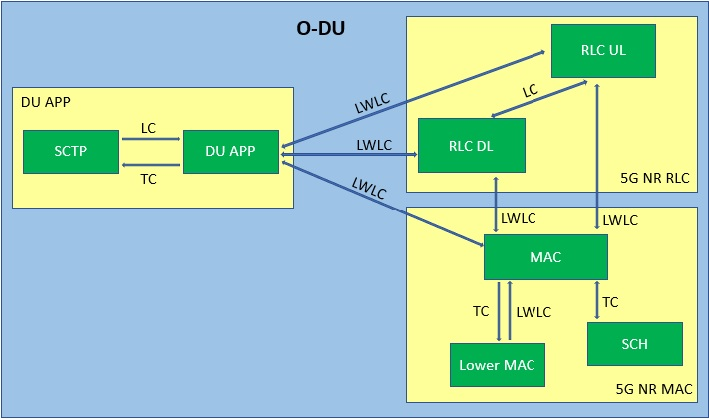
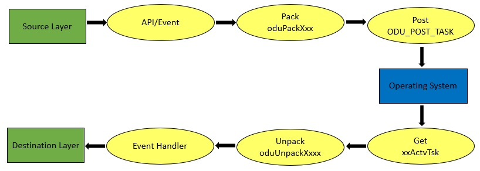

.. This work is licensed under a Creative Commons Attribution 4.0 International License.
.. http://creativecommons.org/licenses/by/4.0

Developer-Guide
===============

.. contents::
   :depth: 3
   :local:

Introduction
------------

It is the developer guide of O-DU High, describing some basic requirements to build the ODU module.

Coding Style
------------

ODU uses C coding style and follows the coding rules as mentioned below:

   A. The line width should not exceed more than 120 characters.
   B. Each new level is indented by 3 spaces.
   C. The header files are declared in the respective .c file.
   D. A new file should have License Header and Footer as shown in the below diagram

.. figure:: LicHeader.jpg
  :width: 600
  :alt: Figure 1 License Header and Footer

  Figure 1 : License Header and Footer

O-DU High code
---------------

Refer the link to clone the repository:

https://gerrit.o-ran-sc.org/r/admin/repos/o-du/l2

Work items on Jira
------------------

For work items on cherry release, refer to JIRA tickets maintained in release-notes

Technical Details
-----------------

When a ODU binaries are built it is responsible for:
   A. Initializing the layers F1AP, EGTP, RLC, MAC
   B. Task scheduling like register, de-register, activating and termianting a task
   C. Memory management like allocating and deallocating variable sized buffers from memory pools
   D. Message management like adding and removing data to and from the message

Thread Management
^^^^^^^^^^^^^^^^^

Creation of Thread:
+++++++++++++++++++

Creates a thread by declaring a system task id for each layer. A System Task is a schedulable unit 
of execution in the underlying operating system. When a system task is created and entry is located
in the system task table.

   ODU_CREATE_TASK (priority, stskId)

      a. Inputs
      
         - priority - Priority of the task
         - stskId - Thread Id of the system task

      b. Returns ROK on success and RFAILED on failure
				     
Setting a core affinity:
++++++++++++++++++++++++

It sets the processor/core affinity for a system task (thread/lwp) based on the mode supplied by the caller.

   ODU_SET_THREAD_AFFINITY (tskId, mode, coreId, tskAssociatedTskId)

      a. Inputs

         - tskId - filled in with system task Id
         - mode - mode according to which the affinity is set
         - coreId - coreId to which the affinity has to be set
         - tskAssociatedTskId - filled in with system task Id of the associated Layer

      b. Returns ROK on success and RFAILED on failure

Registering TAPA task:
+++++++++++++++++++++++

A TAPA Task is a logical entity which represents a layer in ODU. It must be attached to a 
system Task in order to be activated.

   ODU_REG_TTSK (ent, inst, ttype, prior, initTsk, actvTsk)

      a. Inputs

         - ent - Entity id of the task to activate.
                 Example: ENTDUAPP, ENTSCTP, ENTEGTP etc
         - Inst - Instance of the task to activate. It distinguishes between
                  multiple instances of the same entity on a given processor
                  Example: RLC_UL_INST is 0 and RLC_DL_INST is 1						  
         - ttype - It specifies a tapa task type.
	           - TTNORM, normal task- non preemptive
		   - TTPERM, permanent task
         - prior-  It specifies the priority of the task. It ranges from 0 to 3.
		   priority 0 is highest and priority 3 is lowest
         - initTsk - It is an initialization function invoked TAPA task is attached to the system task.
                     Example: duActvInit, egtpActvInit, sctpActvInit
         - actvTsk - This func is responsible to receive any incoming message to that TAPA Task
                     Example: duActvTsk, egtpActvTsk, sctpActvTsk

      b. Returns ROK on success and RFAILED on failure

Attaching TAPA task:
++++++++++++++++++++

Once a TAPA task is attached to a system task, the system task schedules activation
of the TAPA Task based on the tasks priority and on incoming events. Any number of
TAPA Tasks can be attached to a system Task.

   ODU_ATTACH_TTSK (ent, inst, stskId)

   a. Inputs

      - ent - Entity Id of the task
      - inst -  Instance Id of the task
      - stskId - System task Id to use

   b. Returns ROK on success and RFAILED on failure

Memory Management
^^^^^^^^^^^^^^^^^

Configuration
+++++++++++++

Memory is divided into multiple regions(identified by region id) and each region is divided into multiple pools(identified by pool id).
The configurations are present in mt_ss.h and mt_ss.c at <rsys_directory>/l2/src/mt.
Currently, the number of regions configured are 6 and each region has 5 pools.

Region and pool used by each layer is identified by following macros:

   - MAC    - MAC_MEM_REGION and MAC_POOL
   - SCH    - SCH_MEM_REGION and SCH_POOL
   - RLC UL - RLC_MEM_REGION_UL and RLC_POOL
   - RLC_DL - RLC_MEM_REGION_DL and RLC_POOL
   - DU APP - DU_APP_MEM_REGION and DU_POOL

Static Memory
+++++++++++++

Macros are defined at each layer for static memory allocation and deallocation from that layer's region and pool.

   XX_ALLOC(bufPtr, size)

      a. Allocates static buffer
      b. Inputs:

         - bufPtr - pointer to store address of the memory allocated
         - size   - size of memory to be allocated

      c. Returns

         - If allocation is sucessful, butPtr stores memory address
         - If allocation fails, bufPtr is NULL.

   XX_FREE(bufPtr, size)

      a. Frees static buffer
      b. Inputs:

         - bufPtr - pointer to memory to be freed
         - size   - size of memory to be freed

Here, XX stands for various ODU-High layer :

   - MAC    - MAC_ALLOC() & MAC_FREE()
   - SCH    - SCH_ALLOC() & SCH_FREE()
   - RLC    - RLC_ALLOC() & RLC_FREE()
   - DU APP - DU_ALLOC() & DU_FREE()

Sharable Memory
+++++++++++++++

When using LWLC between 2 layers, memory allocated to the interface structure must be sharable. The sender will allocate sharable buffer from its own region and pool. This memory will be freed by receiving layer and returned back to sender's region and pool.

   XX_ALLOC_SHRABL_BUF(bufPtr, size)

      a. Allocates sharable buffer
      b. Inputs:

         - bufPtr - pointer to store address of the memory allocated
         - size   - size of memory to be allocated

      c. Returns

         - If allocation is sucessful, butPtr stores memory address
         - If allocation fails, bufPtr is NULL.

   XX_FREE_SHRABL_BUF(region, pool, bufPtr, size)

      a. Frees sharabale buffer
      b. Inputs:

         - region - region where this buffer is allocated from
         - pool   - pool where this buffer is allocated from
         - bufPtr - pointer to memory to be freed
         - size   - size of memory to be freed

Here, XX stands for ODU-High layer such as :

   - MAC    - MAC_ALLOC_SHRABL_BUF() & MAC_FREE_SHRABL_BUF()
   - SCH    - Since scheduler communicates only with MAC and is tightly coupled, sharable buffers are not needed.
   - RLC    - RLC_ALLOC_SHRABL_BUF() & RLC_FREE_SHRABL_BUF()
   - DU APP - DU_ALLOC_SHRABL_BUF() & DU_FREE_SHRABL_BUF()

Message Buffer
++++++++++++++

A message is an ordered sequence of bytes. It stores both the control information and the data i.e the actual
information being communicated between 2 layers that are loosely or light-weight loosely coupled.
Messages are allocated from dynamic memory.

   ODU_GET_MSG_BUF(region, pool, &mBuf)

      a. Allocates memory for message buffer
      b. Inputs:

         - region - region of sending layer
         - pool   - pool of sending layer
         - &mBuf  - pointer to store memory address of the message

      c. Returns ROK, if sucessful and RFAILED, if error

   ODU_PUT_MSG_BUF(mBuf)

      a. Frees memory for message
      b. Inputs:

         - mBuf - message pointer

      c. Returns ROK, if sucessful and RFAILED, if error

WLS Memory
++++++++++

WLS memory is allocated for message exchanges between O-DU High and O-DU Low.

   LWR_MAC_ALLOC(ptr, size)

      a. Allocates WLS memory block
      b. Inputs:

         - ptr  - pointer to store address of the memory allocated
         - size - size of memory to be allocated

      c. Returns

         - If allocation is sucessful, ptr stores memory address
         - If allocation fails, ptr is NULL.

   LWR_MAC_FREE(ptr, size)

      a. Frees WLS block
      b. Inputs:

         - bufPtr - pointer to memory to be freed
         - size   - size of memory to be freed

Layer Coupling
^^^^^^^^^^^^^^

Layers communicate with each other either through direct function calls (tight coupling) or through message passing.

Tight Coupling (TC)
+++++++++++++++++++

In tight coupling, interface APIs invoked from one task translate into direct function calls into the destination task.
Control returns to the calling task after the called task has completed processing the called function.

   - Macro for TC - ODU_SELECTOR_TC

Loose/Light-Weight Loose Coupling
+++++++++++++++++++++++++++++++++

In this type of coupling, interface APIs invoked from one task are packed into messages that are then sent to the destination task through system services.
Control returns to the calling task immediately after it posts the message, before the destination task has seen or processed the API.

In loose coupling (LC), the interface data is packed into the message. Receiver task will unpack this parameter by parameter.

Whereas in light-weight loose coupling(LWLC), pointer to data is packed and sent. Receiver task will unpack the pointer and directly access data at this address.

   - Macro for LC   - ODU_SELECTOR_LC
   - Macro for LWLC - ODU_SELECTOR_LWLC

Below figure depicts the coupling between various TAPA tasks registered in O-DU High.

   Figure 2: Coupling between TAPA tasks

Inter-Task Communication
^^^^^^^^^^^^^^^^^^^^^^^^

1. Fill Post Structure

   Information needed by system services to route API to the destination layer is stored in post structure.

   | typedef struct pst
   | {
   |     ProcId   dstProcId;    /\* destination processor ID \*/
   |     ProcId   srcProcId;    /\* source processor ID \*/
   |     Ent      dstEnt;       /\* destination entity \*/
   |     Inst     dstInst;      /\* destination instance \*/
   |     Ent      srcEnt;       /\* source entity \*/
   |     Inst     srcInst;      /\* source instance \*/
   |     Prior    prior;        /\* priority \*/
   |     Route    route;        /\* route \*/
   |     Event    event;        /\* event \*/
   |     Region   region;       /\* region \*/
   |     Pool     pool;         /\* pool \*/
   |     Selector selector;     /\* selector \*/
   |     uint16_t spare1;       /\* spare for alignment \*/
   | } Pst;

2. Pack API into message

   At sender, API is packed i.e. the data is stored into a message in ordered sequence of bytes.
   At receiver, the data is unpacked from the message and its corresponding handler is invoked.

   A. If pst->selector is LC, each parameter is packed/unpacked one by one using one of the below.

      - oduPackUInt8(val, mBuf) - Packs 8-bits value(val) into message(mBuf)
      - oduUnpakcUInt8(val, mBuf) - Unpacks 8-bits from message(mBuf) and stores in val
      - oduPackUInt16(val, mBuf) - Packs 16-bits value(val) into message(mBuf)
      - oduUnpakcUInt16(val, mBuf) - Unpacks 16-bits from message(mBuf) and stores in val
      - oduPackUInt32(val, mBuf) - Packs 32-bits value(val) into message(mBuf)
      - oduUnpakcUInt32(val, mBuf) - Unpacks 16-bits from message(mBuf) and stores in val

      The sequence in which the parameters are unpacked must be reverse of the packing sequence i.e. the parameter
      packed last will be unpacked first and vice-versa.

   B. If pst->selector is LWLC, pointer to the interface structure is packed/unpacked.

      - oduPackPointer(ptr, mBuf) - Packs pointer value(ptr) into message(mBuf)
      - oduUnpackPointer(ptr, mBuf) - Unpacks pointer value from message(mBuf) and stores in ptr

3. Post the message

   Once the post information is filled and API is packed into a message, it is posted to destination using:

      ODU_POST_TASK(pst, mBuf)

         a. Inputs

            - pst  - post structure mentioned above
            - mBuf - message

         b. Return ROK, if sending is successful and RFAILED, if error

The above steps of communication between various TAPA tasks in O-DU High are summarized in Figure 3 below :

   Figure 3: Communication between TAPA tasks

WLS Interface
^^^^^^^^^^^^^

ODU-High communicates with Intel O-DU Low over WLS interface. Following APIs are used at Lower MAC to send/receive messages from O-DU Low.
Using these APIs require including "wls_lib.h" library.

1. WLS_Open

   void\* WLS_Open(const char \*ifacename, unsigned int mode, unsigned long long nWlsMemorySize)

      a. Description

         - Opens the WLS interface and registers as instance in the kernel space driver.
         - Control section of shared memory is mapped to application memory.

      b. Inputs:

         - ifacename - pointer to string with device driver name (/dev/wls)
         - mode      - mode of operation (Master or Slave). Here, O-DU High acts as MASTER.

      c. Returns pointer handle to WLS interface for future use by WLS functions

2. WLS_Ready

   int WLS_Ready(void \*h)

      a. Description

         - Checks the state of remote peer of WLS interface

      b. Inputs the handle of WLS interface
      c. Returns 0 if peer is available i.e. one to one connection is established

3. WLS_Close

   int WLS_Close(void \*h)

      a. Description

         - Closes the WLS interface and deregisters as instance in the kernel space driver
         - Control section of shared memory is unmapped form user space application

      b. Inputs the handle of WLS interface to be closed
      c. Returns 0 in case of success

4. WLS_Alloc

   void\* WLS_Alloc(void\* h, unsigned int size)

      a. Description

         - Allocates memory block for data exchange shared memory. Memory block is backed by huge pages.
         - Memory is allocated only once for L2, and divided into various regions.

      b. Input

         - \*h   - handle of WLS interface
         - size - size of memory block to allocate

      c. Returns pointer to allocated memory block or NULL if no memory available

5. WLS_Free

   int WLS_Free(void\* h, void\* pMsg)

      a. Description

         - Frees memory block for data exchange shared memory.

      b. Input

         - h    - handle of WLS interface
         - pMsg - pointer to WLS memory

      c. Returns 0 if operation is sucessful

6. WLS_Put

   int WLS_Put(void\* h, unsigned long long pMsg, unsigned int MsgSize, unsigned short MsgTypeID, unsigned short Flags)

      a. Description

         - Puts memory block (or group of blocks) allocated from WLS memory into interface for transfer to remote peer

      b. Input

         - h    - handle of WLS interface
         - pMsg - pointer to memory block (physical address) with data to be transfered to remote peer. Pointer should belong to WLS memory allocated via WLS_Alloc()
         - MsgSize - size of memory block to send (should be less than 2 MB)
         - MsgTypeID - application specific identifier of message type
         - Flags - Scatter/Gather flag if memory block has multiple chunks

      c. Returns 0, if sucessful and -1, if error

7. WLS_Check

   int WLS_Check(void\* h)

      a. Description

         - Checks if there are memory blocks with data from remote peer

      b. Inputs the handle of WLS interface
      c. Returns number of blocks available for "get" operation

8. WLS_Wait

   int WLS_Wait(void\* h)

      a. Description

         - Waits for new memory block from remote peer
         - Blocking call

      b. Inputs the handle of WLS interface
      c. Returns number of blocks available for "get" operation

9. WLS_Get

   unsigned long long WLS_Get(void\* h, unsigned int \*MsgSize, unsigned short \*MsgTypeID, unsigned short \*Flags)

      a. Description

         - Gets memory block from interface received from remote peer.
         - Non-blocking operation

      b. Input
   
         - h    - handle of WLS interface
         - \*MsgSize - pointer to set size of memory block
         - \*MsgTypeID - pointer to application specific identifier of message type
         - \*Flags - pointer to Scatter/Gather flag if memory block has multiple chunks

      c. Returns
  
         - Pointer to memory block (physical address) with data received from remote peer
         - NULL if error or no blocks available

10. WLS_WGet

    unsigned long long WLS_WGet(void\* h, unsigned int \*MsgSize, unsigned short \*MsgTypeID, unsigned short \*Flags)

       a. Description

          - Gets memory block from interface received from remote peer
          - Function is blocking operation and waits till next memory block from remote peer

       b. Input

          - h    - handle of WLS interface
          - \*MsgSize - pointer to set size of memory block
          - \*MsgTypeID - pointer to application specific identifier of message type
          - \*Flags - pointer to Scatter/Gather flag if memory block has multiple chunks

       c. Returns

          - Pointer to memory block (physical address) with data received from remote peer
          - NULL -  if error

11. WLS_WakeUp

    int WLS_WakeUp(void\* h)

       a. Description

          - Performs "wakeup" notification to remote peer to unblock "wait" operations pending

       b. Inputs the handle of WLS interface
       c. Returns 0 if successful

12. WLS_VA2PA

    unsigned long long WLS_VA2PA(void\* h, void\* pMsg)

       a. Description

          - Converts virtual address (VA) to physical address (PA)

       b. Input

          - h    - handle of WLS interface
          - pMsg - virtual address of WLS memory block

       c. Returns

          - Physical address of WLS memory block
          - NULL, if error

13. WLS_PA2VA

    void\* WLS_PA2VA(void\* h, unsigned long long pMsg)

       a. Description

          - Converts physical address (PA) to virtual address (VA)

       b. Input

          - h    - handle of WLS interface
          - pMsg - physical address of WLS memory block

       c. Returns

          - Virtual address of WLS memory block
          - NULL, if error

14. WLS_EnqueueBlock

    int WLS_EnqueueBlock(void\* h, unsigned long long pMsg)

       a. Description

          - Used by master to provide memory blocks to slave for next slave to master transfer of data

       b. Input

          - h    - handle of WLS interface
          - pMsg - physical address of WLS memory block

       c. Returns 0, if successful and 1, if error

15. WLS_DequeueBlock

   unsigned long long WLS_DequeueBlock(void\* h)

      a. Description

         - Used by master and slave to get block from master to slave queue of available memory blocks

      b. Input the handle of WLS interface
      c. Returns

         - Physical address of WLS memory block
         - NULL, if error

16. WLS_NumBlocks

    int WLS_NumBlocks(void\* h)

       a. Description

          - Returns number of current available block provided by master for new transfer of data from slave

       b. Input the handle of WLS interface
       c. Returns number of available blocks in slave to master queue

Additional Utility Functions
^^^^^^^^^^^^^^^^^^^^^^^^^^^^

1. ODU_SET_PROC_ID(procId)
      
      a. Processors are identified by processor identifiers (ProcId) that are globally unique.
         It sets the procId for the local processor
         Example: In ODU, DU_PROC is 0
      b. Inputs

         - procId - process id to be set
   
      c. Return none

2. ODU_GET_PROCID()

      a. Finds and returns the local processor id on which the calling task is running
      b. Inputs

         - void
      
      c. Returns the processor Id.

3. ODU_CAT_MSG(mbuf1, mbuf2, order)
    
      a. It is used to concatenate the given two message.
      b. Inputs

         - mbuf1 - pointer to message buffer 1
         - mbuf2 - pointer to message buffer 2
         - order - order in which the messages are concatenated. Allowable values are:

              - M1M2 - Place message 2 at the end of message 1.
              - M2M1 - Place message 2 in front of message 1.

      c. Returns ROK on success and RFAILED on failure

4. ODU_GET_MSG_LEN(mBuf, lngPtr)

      a. It determines the length of the data contents of a message 
      b. Inputs

         - mBuf - pointer to the message buffer
         - lngPtr - pointer to the location where the length of the message is placed

      c. Returns ROK on success and RFAILED on failure

5. ODU_EXIT_TASK()

      a. It is used to gracefully exist the process
      b. Inputs
         - void

      c. Returns void

6. ODU_PRINT_MSG(mBuf, src, dst)

      a. It prints the following information for a message: queue length, message length, direction,
         hexadecimal, and ASCII (if appropriate) values of all data bytes in the message.
      b. Inputs

         - mBuf - pointer to the message buffer
         - src  - source Id
         - dest - destination Id

      c. Returns ROK on success and RFAILED on failure
   
7. ODU_REM_PRE_MSG(dataPtr, mBuf)

      a. Removes one byte of data from the beginning of a message
      b. Inputs

         - dataPtr - pointer to the location where one byte of data is placed
         - mBuf - pointer to the message buffer

      c. Return ROK on success, ROKDNA on message empty and RFAILED on failure
   
8. ODU_REM_PRE_MSG_MULT(dst, cnt, mBuf)

      a. Removes the specified number of bytes of data from the beginning of a message 
      b. Inputs

         - dst - pointer to the location where the data bytes are placed.
	 - cnt - number of bytes to be removed from the message.
	 - mBuf- pointer to the message.

      c. Return ROK on success, ROKDNA on message too short and RFAILED on failure

9. ODU_REG_TMR_MT(ent, inst, period, func)

      a. It is used by a TAPA task to register its timer function. The system services periodically invokes the
         function passed to it at the specified intervals.
      b. Inputs

         - ent - entity ID of task registering the timer.
	 - inst - instance of task registering the timer.
	 - period - period in system ticks between system service sccessive scheduling 
	   of the timer function in the task. 
	 - func - timer function.

      c. Returns ROK on success and RFAILED on failure

10. ODU_SEGMENT_MSG(mBuf1, idx, mBuf2)

      a. It segments message 1 into two messages at the specified index. 
      b. Inputs

         - mBuf1: pointer to message buffer 1 (original message to be segmented).
         - idx: index into message 1 from which message 2 is created.
         - mBuf2: pointer to message buffer 2 (new message).

       c. Return ROK on success, ROKDNA on message1 too short, ROUTERES on out of resources
          and RFAILED on failure

11. ODU_ADD_PRE_MSG_MULT(src, cnt, dst)

       a. Copies consecutive bytes of data to the beginning of a message
       b. Inputs

          - src - source buffer
	  - cnt - number of bytes
	  - dst - destination message

       c. Returns ROK if success, RFAILED on failure to copy and ROUTRES when out of resources

12. ODU_ADD_PRE_MSG_MULT_IN_ORDER(src, cnt, dst)

       a. Copies consecutive bytes of data to the beginning of a message and keeps the bytes order preserved
       b. Inputs
       
          - src - source buffer
          - cnt - number of bytes
          - dst - destination message
       
       c. Returns ROK if success, RFAILED on failure to copy and ROUTRES when out of resources

13. ODU_ADD_POST_MSG_MULT(src, cnt, dst)

       a. Copies consecutive bytes of data to the end of a message
       b. Inputs
       
          - src - source buffer
          - cnt - number of bytes
          - dst - destination message
       
       c. Returns ROK if success, RFAILED on failure to copy and ROUTRES when out of resources

14. ODU_COPY_MSG_TO_FIX_BUF(src, srcIdx, cnt, dst, ccnt)

       a. Copies data from a messae into a fixed buffer
       b. Inputs

          - src - source message
          - srcIdx - byte index of source from where to start copying
	  - cnt - number of bytes to be copied
	  - dst - destination buffer
	  - ccnt - number of bytes copied

       c. Returns ROK if success, RFAILED on failure to copy and ROUTRES when out of resources

15. ODU_COPY_FIX_BUF_TO_MSG

       a. Copies data from a fixed buffer to a message
       b. Inputs
          
	  - src - source buffer
	  - dst - destination message
	  - dstIdx - index in destination message to starting copying bytes from
	  - cnt - number of bytes to be copied
	  - ccnt - number of bytes copied

       c. Returns ROK if success, RFAILED on failure to copy and ROUTRES when out of resources 

