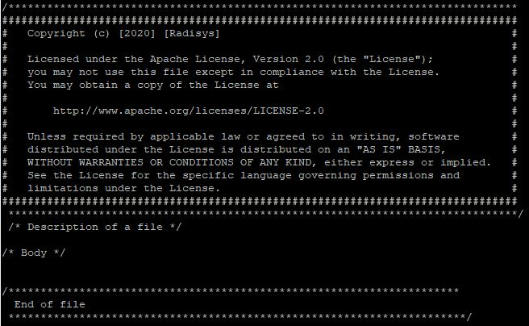
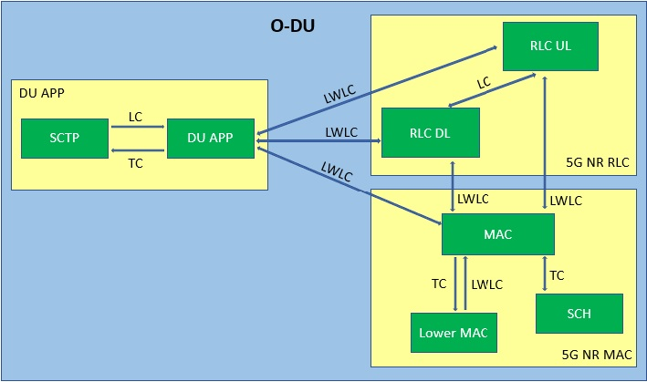
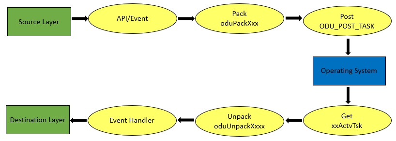

.. This work is licensed under a Creative Commons Attribution 4.0 International License.
.. http://creativecommons.org/licenses/by/4.0

Developer-Guide
===============

.. contents::
   :depth: 3
   :local:

Introduction
------------

This document provides information required to work on O-DU High code-base.

Coding Style
------------

O-DU High uses C languages. The coding guidelines followed are:

   a. A new file should have License Header and Footer with exception of auto-generated files like files generated by
      ASN tool. Refer to the diagram below for License header. 
   b. Every block must be indented by 3 spaces.
   c. Any header file must be included only in .c file, not in other header files.
   d. The line width should not exceed more than 120 characters.

  Figure 8 : License Header and Footer

O-DU High code
---------------

Refer to O-DU High code-base at: https://gerrit.o-ran-sc.org/r/gitweb?p=o-du/l2.git;a=tree

Technical Details
-----------------

Below section references coding specifics of O-DU High components.

Thread Management
^^^^^^^^^^^^^^^^^

Creation of Thread:
+++++++++++++++++++

In O-DU High, multiple threads are created using below macro

   ODU_CREATE_TASK (priority, stskId)

      a. Creates a thread by declaring a thread id
      b. Inputs
      
         - priority - Priority of the task
         - stskId - Thread Id
				     
Setting a core affinity:
++++++++++++++++++++++++

   ODU_SET_THREAD_AFFINITY (tskId, mode, coreId, tskAssociatedTskId)

      a. Sets the processor/core affinity for a thread based on the mode supplied by the caller.
      b. Inputs

         - tskId - thread Id
         - mode - mode according to which the affinity is set
         - coreId - coreId to which the affinity has to be set
         - tskAssociatedTskId - thread Id of the associated layer

      c. Returns ROK on success and RFAILED on failure

Registering Entities:
+++++++++++++++++++++++

All logical entities in O-DU High must be registered into the database.

   ODU_REG_TTSK (ent, inst, ttype, prior, initTsk, actvTsk)

      a. Inputs

         - ent - Id of the entity to activate. Example: ENTDUAPP, ENTSCTP, ENTEGTP etc
         - Inst - Instance of the entity to activate. It distinguishes between multiple instances of the same entity on a
	   given processor. Example: RLC_UL_INST (Instance id 0) and RLC_DL_INST (Instance id 1) belong to the same entity id, ENTRLC.
         - ttype - Type of entity
         - prior - Priority, ranges from 0(Highest) to 3(Lowest).
         - initTsk - Initialization function(xxActvInit) of the entity being registered gets invoked. Example: duActvInit initializes DU APP
         - actvTsk - This function(xxActvTsk) is responsible to receive any incoming message to that entity. Example: duActvTsk is triggerred when a message comes to DU APP

Attaching Entity to Thread:
+++++++++++++++++++++++++++

Every entity must be attached to a thread to schedule its activation based on priority and incoming events. Any number
of entities can be attached to a system task.

   ODU_ATTACH_TTSK (ent, inst, stskId)

      a. Inputs

         - ent - Entity Id of the task
         - inst -  Instance Id of the task
         - stskId - Thread Id to use

Memory Management
^^^^^^^^^^^^^^^^^

Configuration
+++++++++++++

Memory is divided into multiple regions(identified by region id) and each region is divided into multiple pools(identified by pool id).
The configurations are present in mt_ss.h and mt_ss.c at <rsys_directory>/l2/src/mt.
Currently, the number of regions configured are 6 and each region has 5 pools.

Region and pool used by each layer is identified by following macros:

   - MAC    - MAC_MEM_REGION and MAC_POOL
   - SCH    - SCH_MEM_REGION and SCH_POOL
   - RLC UL - RLC_MEM_REGION_UL and RLC_POOL
   - RLC_DL - RLC_MEM_REGION_DL and RLC_POOL
   - DU APP - DU_APP_MEM_REGION and DU_POOL

Static Memory
+++++++++++++

Macros are defined at each layer for static memory allocation/deallocation from that layer's region and pool.

   XX_ALLOC(bufPtr, size)

      a. Allocates static buffer
      b. Inputs:

         - bufPtr - pointer to store address of the memory allocated
         - size   - size of memory to be allocated

      c. Result:

         - If allocation is sucessful, butPtr stores memory address
         - If allocation fails, bufPtr is NULL.

   XX_FREE(bufPtr, size)

      a. Frees static buffer
      b. Inputs:

         - bufPtr - pointer to memory to be freed
         - size   - size of memory to be freed

Here, XX stands for various ODU-High entity i.e.

   - MAC    - MAC_ALLOC & MAC_FREE
   - SCH    - SCH_ALLOC & SCH_FREE
   - RLC    - RLC_ALLOC & RLC_FREE
   - DU APP - DU_ALLOC & DU_FREE

Sharable Memory
+++++++++++++++

One of the methods of communication between layers is through sharabale memory.
The sender will allocate sharable buffer from its own region and pool. 
This memory will be freed by receiving layer and returned back to sender's region and pool.

   XX_ALLOC_SHRABL_BUF(bufPtr, size)

      a. Allocates sharable buffer
      b. Inputs:

         - bufPtr - pointer to store address of the memory allocated
         - size   - size of memory to be allocated

      c. Result:

         - If allocation is sucessful, butPtr stores memory address
         - If allocation fails, bufPtr is NULL.

   XX_FREE_SHRABL_BUF(region, pool, bufPtr, size)

      a. Frees sharabale buffer
      b. Inputs:

         - region - region where this buffer is allocated from
         - pool   - pool where this buffer is allocated from
         - bufPtr - pointer to memory to be freed
         - size   - size of memory to be freed

Here, XX stands for various ODU-High entities i.e.

   - MAC    - MAC_ALLOC_SHRABL_BUF & MAC_FREE_SHRABL_BUF
   - SCH    - Since scheduler communicates only with MAC and is tightly coupled, sharable buffers are not needed.
   - RLC    - RLC_ALLOC_SHRABL_BUF & RLC_FREE_SHRABL_BUF
   - DU APP - DU_ALLOC_SHRABL_BUF & DU_FREE_SHRABL_BUF

Message Buffer
++++++++++++++

A message is an ordered sequence of bytes. It stores both the control information and the data being communicated.
Message buffers are allocated from dynamic memory.

   ODU_GET_MSG_BUF(region, pool, mBuf)

      a. Allocates memory for message buffer
      b. Inputs:

         - region - region of sending layer
         - pool   - pool of sending layer
         - mBuf   - pointer to message buffer

   ODU_PUT_MSG_BUF(mBuf)

      a. Frees memory for message
      b. Inputs:

         - mBuf - message pointer

WLS Memory
++++++++++

WLS memory is allocated for message exchanges between O-DU High and O-DU Low.

   LWR_MAC_ALLOC(ptr, size)

      a. Allocates WLS memory block
      b. Inputs:

         - ptr  - pointer to store address of the memory allocated
         - size - size of memory to be allocated

      c. Result:

         - If allocation is sucessful, ptr stores memory address
         - If allocation fails, ptr is NULL.

   LWR_MAC_FREE(ptr, size)

      a. Frees WLS block
      b. Inputs:

         - bufPtr - pointer to memory to be freed
         - size   - size of memory to be freed

Intra O-DU High Communication
^^^^^^^^^^^^^^^^^^^^^^^^^^^^^

O-DU high entities communicate with each other through one of the following:

Types of Communication
++++++++++++++++++++++

Direct API Call
###############

Interface APIs invoked from one entity translate into direct function calls into the destination entity.
Control returns to the calling entity after the called entity has completed processing the called function.

   Macro to select this communication mode : ODU_SELECTOR_TC

Serialization
#############

Interface API invoked from one entity is packed into a message and then sent to destination entity through system services.
Control returns to the caller immediately after the message is posted, before the destination has seen or processed it.
There are two serialization methods supported:

   a. Pack/Unpack data 

      - The interface data is packed into the message. Receiver will unpack this, parameter by parameter.
      - Macro to select this communication mode : ODU_SELECTOR_LC

   b. Pack/Unpack pointer 
   
      - The pointer to data is packed and sent. Receiver will unpack the pointer and directly access data at this address.
      - Macro to select this communication mode : ODU_SELECTOR_LWLC

Below figure depicts the mode of communication between various entities registered in O-DU High.
Here, 

   - TC stands for Direct API call
   - LC stands for Serialization by packing/unpacking of data
   - LWLC stands for Serialization by packing/unpacking of pointers

   Figure 9: Mode of communication between O-DU High entities

Steps of Communication
++++++++++++++++++++++

1. Fill Post Structure

   Information needed by system services to route API to the destination layer is stored in post structure.

   | typedef struct pst
   | {
   |     ProcId   dstProcId;    /\* destination processor ID \*/
   |     ProcId   srcProcId;    /\* source processor ID \*/
   |     Ent      dstEnt;       /\* destination entity \*/
   |     Inst     dstInst;      /\* destination instance \*/
   |     Ent      srcEnt;       /\* source entity \*/
   |     Inst     srcInst;      /\* source instance \*/
   |     Prior    prior;        /\* priority \*/
   |     Route    route;        /\* route \*/
   |     Event    event;        /\* event \*/
   |     Region   region;       /\* region \*/
   |     Pool     pool;         /\* pool \*/
   |     Selector selector;     /\* selector \*/
   |     uint16_t spare1;       /\* spare for alignment \*/
   | } Pst;

2. Pack API into message

   At sender, API is packed i.e. the data is stored into a message in ordered sequence of bytes.
   At receiver, the data is unpacked from the message and its corresponding handler is invoked.

   a. If pst->selector is LC, each parameter is packed/unpacked one by one using one of the below.

      - oduPackUInt8(val, mBuf) - Packs 8-bits value(val) into message(mBuf)
      - oduUnpakcUInt8(val, mBuf) - Unpacks 8-bits from message(mBuf) and stores in val
      - oduPackUInt16(val, mBuf) - Packs 16-bits value(val) into message(mBuf)
      - oduUnpakcUInt16(val, mBuf) - Unpacks 16-bits from message(mBuf) and stores in val
      - oduPackUInt32(val, mBuf) - Packs 32-bits value(val) into message(mBuf)
      - oduUnpakcUInt32(val, mBuf) - Unpacks 16-bits from message(mBuf) and stores in val

      The sequence in which the parameters are unpacked must be reverse of the packing sequence.

   b. If pst->selector is LWLC, pointer to the interface structure is packed/unpacked.

      - oduPackPointer(ptr, mBuf) - Packs pointer value(ptr) into message(mBuf)
      - oduUnpackPointer(ptr, mBuf) - Unpacks pointer value from message(mBuf) and stores in ptr

3. Post the message

   Once the post information is filled and API is packed into a message, it is posted to destination using:

      ODU_POST_TASK(pst, mBuf)

         a. Inputs

            - pst  - post structure mentioned above
            - mBuf - message

Below figure summarized the above steps of intra O-DU High communication

   Figure 10: Steps of Communication between O-DU High entities

Communication with Intel O-DU Low
^^^^^^^^^^^^^^^^^^^^^^^^^^^^^^^^^^

Intel O-DU Low communicates with O-DU High over WLS interface. Hence, Intel's "wls_lib.h" library is required for using
the following APIs for communication.

1. **WLS_Open**

   *void\* WLS_Open(const char \*ifacename, unsigned int mode, unsigned long long nWlsMemorySize)*

      a. Description

         - Opens the WLS interface and registers as instance in the kernel space driver.
         - Control section of shared memory is mapped to application memory.

      b. Inputs:

         - ifacename - pointer to string with device driver name (/dev/wls)
         - mode      - mode of operation (Master or Slave). Here, O-DU High acts as MASTER.

      c. Returns pointer handle to WLS interface for future use by WLS functions

2. **WLS_Ready**

   *int WLS_Ready(void \*h)*

      a. Description

         - Checks the state of remote peer of WLS interface

      b. Inputs - handle of WLS interface
      c. Returns 0 if peer is available i.e. one to one connection is established

3. **WLS_Close**

   *int WLS_Close(void \*h)*

      a. Description

         - Closes the WLS interface and de-registers as instance in the kernel space driver
         - Control section of shared memory is unmapped form user space application

      b. Input - handle of WLS interface to be closed
      c. Returns 0 if operation is successful

4. **WLS_Alloc**

   *void\* WLS_Alloc(void\* h, unsigned int size)*

      a. Description

         - Allocates memory block for data exchange shared memory. Memory block is backed by huge pages.
         - Memory is allocated only once for L2, and divided into various regions.

      b. Input

         - h   - handle of WLS interface
         - size - size of memory block to allocate

      c. Returns 
         
	 - Pointer to allocated memory block
	 - NULL on memory allocation failure

5. **WLS_Free**

   *int WLS_Free(void\* h, void\* pMsg)*

      a. Description

         - Frees memory block for data exchanged on shared memory.

      b. Input

         - h    - handle of WLS interface
         - pMsg - pointer to WLS memory

      c. Returns 0 if operation is sucessful

6. **WLS_Put**

   *int WLS_Put(void\* h, unsigned long long pMsg, unsigned int MsgSize, unsigned short MsgTypeID, unsigned short
   Flags)*

      a. Description

         - Puts memory block (or group of blocks) allocated from WLS memory into the interface to transfer to remote peer

      b. Input

         - h    - handle of WLS interface
         - pMsg - pointer to memory block (physical address) with data to be transfered to remote peer
         - MsgSize - size of memory block to send (should be less than 2 MB)
         - MsgTypeID - application specific identifier of message type
         - Flags - Scatter/Gather flag if memory block has multiple chunks

      c. Returns 0 if operation is successful

7. **WLS_Check**

   *int WLS_Check(void\* h)*

      a. Description

         - Checks if there are memory blocks with data from remote peer

      b. Input - handle of WLS interface
      c. Returns number of blocks available for "get" operation

8. **WLS_Wait**

   *int WLS_Wait(void\* h)*

      a. Description

         - Waits for new memory block from remote peer
         - Blocking call

      b. Input - the handle of WLS interface
      c. Returns number of blocks available for "get" operation

9. **WLS_Get**

   *unsigned long long WLS_Get(void\* h, unsigned int \*MsgSize, unsigned short \*MsgTypeID, unsigned short \*Flags)*

      a. Description

         - Gets memory block from interface received from remote peer.
         - Non-blocking operation

      b. Input
   
         - h    - handle of WLS interface
         - MsgSize - pointer to set size of memory block
         - MsgTypeID - pointer to application specific identifier of message type
         - Flags - pointer to Scatter/Gather flag if memory block has multiple chunks

      c. Returns
  
         - Pointer to memory block (physical address) with data received from remote peer
         - NULL if error or no blocks available

10. **WLS_WGet**

    *unsigned long long WLS_WGet(void\* h, unsigned int \*MsgSize, unsigned short \*MsgTypeID, unsigned short \*Flags)*

       a. Description

          - Gets memory block from interface received from remote peer
          - It is a blocking operation and waits for next memory block from remote peer

       b. Input

          - h    - handle of WLS interface
          - MsgSize - pointer to set size of memory block
          - MsgTypeID - pointer to application specific identifier of message type
          - Flags - pointer to Scatter/Gather flag if memory block has multiple chunks

       c. Returns

          - Pointer to memory block (physical address) with data received from remote peer
          - NULL if error or no blocks available

11. **WLS_WakeUp**

    *int WLS_WakeUp(void\* h)*

       a. Description

          - Performs "wakeup" notification to remote peer to unblock "wait" operations pending

       b. Input - handle of WLS interface
       c. Returns 0 if operation is successful

12. **WLS_VA2PA**

    *unsigned long long WLS_VA2PA(void\* h, void\* pMsg)*

       a. Description

          - Converts virtual address (VA) to physical address (PA)

       b. Input

          - h    - handle of WLS interface
          - pMsg - virtual address of WLS memory block

       c. Returns

          - Physical address of WLS memory block
          - NULL, if error

13. **WLS_PA2VA**

    *void\* WLS_PA2VA(void\* h, unsigned long long pMsg)*

       a. Description

          - Converts physical address (PA) to virtual address (VA)

       b. Input

          - h    - handle of WLS interface
          - pMsg - physical address of WLS memory block

       c. Returns

          - Virtual address of WLS memory block
          - NULL, if error

14. **WLS_EnqueueBlock**

    *int WLS_EnqueueBlock(void\* h, unsigned long long pMsg)*

       a. Description

          - Used by the Master to provide memory blocks to slave for next slave-to-master data transfer

       b. Input

          - h    - handle of WLS interface
          - pMsg - physical address of WLS memory block

       c. Returns 0 if opertaion is successful

15. **WLS_DequeueBlock**

    *unsigned long long WLS_DequeueBlock(void\* h)*

      a. Description

         - Used by the Master and Slave to get block from master-to-slave queue of available memory blocks

      b. Input - handle of WLS interface
      c. Returns

         - Physical address of WLS memory block
         - NULL, if error

16. **WLS_NumBlocks**

    *int WLS_NumBlocks(void\* h)*

       a. Description

          - Returns number of current available block provided by the Master for new transfer of data from slave

       b. Input - handle of WLS interface
       c. Returns number of available blocks in slave to master queue

Additional Utility Functions
^^^^^^^^^^^^^^^^^^^^^^^^^^^^

1. ODU_START_TASK(startTime, taskId)

      a. Gives current time through input parameter
      b. Input

         - startTime - stores current time to be returned
         - taskId - task id of calling entity

2. ODU_STOP_TASK(startTime, taskId)

      a. Calculates difference of start time and current time.
      b. Input

         - startTime - start time of this task
         - taskId - taskId of calling entity

3. ODU_SET_PROC_ID(procId)
      
      a. Processors are identified by processor identifiers (ProcId) that are globally unique.
         It sets the procId for the local processor. In O-DU High, procId is 0 (DU_PROC)
      b. Inputs

         - procId - process id to be set

4. ODU_GET_PROCID()

      a. Finds and returns the local processor id on which the calling task is running
      b. Inputs

         - void

5. ODU_CAT_MSG(mbuf1, mbuf2, order)
    
      a. Concatenates the given two message.
      b. Inputs

         - mbuf1 - pointer to message buffer 1
         - mbuf2 - pointer to message buffer 2
         - order - order in which the messages are concatenated

6. ODU_GET_MSG_LEN(mBuf, lngPtr)

      a. Determines length of the data contents of a message 
      b. Inputs

         - mBuf - pointer to the message buffer
         - lngPtr - pointer to store length value

7. ODU_EXIT_TASK()

      a. Gracefully exits the process
      b. Inputs

         - void

8. ODU_PRINT_MSG(mBuf, src, dst)

      a. Prints information about message buffer.
      b. Inputs

         - mBuf - pointer to the message buffer
         - src  - source Id
         - dest - destination Id
   
9. ODU_REM_PRE_MSG(dataPtr, mBuf)

      a. Removes one byte of data from the beginning of a message
      b. Inputs

         - dataPtr - pointer to the location where one byte of data is placed
         - mBuf - pointer to the message buffer
   
10. ODU_REM_PRE_MSG_MULT(dst, cnt, mBuf)

      a. Removes the specified number of bytes of data from the beginning of a message 
      b. Inputs

         - dst - pointer to the location where the data bytes are placed.
	 - cnt - number of bytes to be removed from the message.
	 - mBuf- pointer to the message.

11. ODU_REG_TMR_MT(ent, inst, period, func)

      a. Registers timer function of an entity with system services
      b. Inputs

         - ent - entity ID of task registering the timer.
	 - inst - instance of task registering the timer.
	 - period - period in system ticks between system service sccessive scheduling 
	   of the timer function in the entity
	 - func - timer function.

12. ODU_SEGMENT_MSG(mBuf1, idx, mBuf2)

      a. Segments a message into two messages at the specified index. 
      b. Inputs

         - mBuf1 - Message 1, original message to be segmented
         - idx - index in message 1 from which message 2 is created.
         - mBuf2 - pointer to message buffer 2 (new message).

13. ODU_ADD_PRE_MSG_MULT(src, cnt, dst)

       a. Copies consecutive bytes of data to the beginning of a message
       b. Inputs

          - src - source buffer
	  - cnt - number of bytes
	  - dst - destination message

14. ODU_ADD_PRE_MSG_MULT_IN_ORDER(src, cnt, dst)

       a. Copies consecutive bytes of data to the beginning of a message and keeps the bytes order preserved
       b. Inputs
       
          - src - source buffer
          - cnt - number of bytes
          - dst - destination message

15. ODU_ADD_POST_MSG_MULT(src, cnt, dst)

       a. Copies consecutive bytes of data to the end of a message
       b. Inputs
       
          - src - source buffer
          - cnt - number of bytes
          - dst - destination message
       
16. ODU_COPY_MSG_TO_FIX_BUF(src, srcIdx, cnt, dst, ccnt)

       a. Copies data from a message buffer into a fixed buffer
       b. Inputs

          - src - source message
          - srcIdx - start index of source buffer to be copied
	  - cnt - number of bytes to be copied
	  - dst - destination buffer
	  - ccnt - number of bytes copied

17. ODU_COPY_FIX_BUF_TO_MSG(src, dst, dstIdx, cnt, ccnt)

       a. Copies data from a fixed buffer to a message buffer
       b. Inputs
          
	  - src - source buffer
	  - dst - destination message
	  - dstIdx - index in destination message to starting copying bytes from
	  - cnt - number of bytes to be copied
	  - ccnt - number of bytes copied

O1 Module
----------

Coding Style
^^^^^^^^^^^^

O1 uses GNU C++ language.

ODU - O1 Communication 
^^^^^^^^^^^^^^^^^^^^^^

O1 module runs as a thread in O-DU High.

Alarm communication between the threads happen on a Unix socket. 

O-DU High sends alarm messages in the following structure using Alarm Interface APIs.

Alarm Structure
   |   typedef struct
   |   {
   |        MsgHeader msgHeader;                           /\* Alarm action raise/clear \*/
   |        EventType eventType;                           /\* Alarm event type \*/
   |        char objectClassObjectInstance[OBJ_INST_SIZE]; /\* Name of object that raise/clear an alarm \*/
   |        char alarmId[ALRM_ID_SIZE];                    /\* Alarm Id \*/
   |        char alarmRaiseTime[DATE_TIME_SIZE];           /\* Time when alarm is raised \*/
   |        char alarmChangeTime[DATE_TIME_SIZE];          /\* Time when alarm is updated \*/
   |        char alarmClearTime[DATE_TIME_SIZE];           /\* Time when alarm is cleared \*/
   |        char probableCause[TEXT_SIZE];                 /\* Probable cause of alarm \*/
   |        SeverityLevel perceivedSeverity;               /\* Severity level of alarm \*/
   |        char rootCauseIndicator[TEXT_SIZE];            /\* Root cause of alarm \*/
   |        char additionalText[TEXT_SIZE];                /\* Additional text describing alarm \*/
   |        char additionalInfo[TEXT_SIZE];                /\* Any additional information \*/
   |        char specificProblem[TEXT_SIZE];               /\* Any specific problem related to alarm \*/
   |   }AlarmRecord;

O1 - Netconf Communication 
^^^^^^^^^^^^^^^^^^^^^^^^^^

O1 communicates with the Netconf server using sysrepo and libyang APIs
