.. This work is licensed under a Creative Commons Attribution 4.0 International License.
.. SPDX-License-Identifier: CC-BY-4.0

==================
O-DU High Overview
==================

**********************
O-DU High Architecture
**********************

O-DU implements the functional blocks of L2 layer of a 5G NR protocol stack in SA(StandAlone) mode.
These layers primarily include NR MAC, NR Scheduler and NR RLC layers.

O-DU modules are developed as shown in the below diagram.

.. figure:: ODUArch.jpg
  :width: 600
  :alt: Figure 1 O-DU High Architecture Diagram

  Figure 1 - O-DU High Architecture Diagram

******************************
O-DU High Thread Architecture
******************************

As shown in Figure 1, there are multiple entities within O-DU High. Modules sharing a
given color belong to one thread. O-DU architecture can be defined at a thread
level as follows:

- Thread 1: O-DU thread

- Thread 2: DU APP inclusive of Config Handler, DU Manager, UE Manager, and ASN.1 Codecs

- Thread 3: 5G NR RLC DL and MAC (inclusive of 5G NR SCH and Lower MAC)

- Thread 4: 5G NR RLC UL

- Thread 5: SCTP Handler

- Thread 6: Lower MAC Handler

- Thread 7: EGTP Handler

- Thread 8: O1

*****************
O-DU High Modules
*****************

DU APP 
------

This module configures and manages all the operations of O-DU.
It interfaces with external entities as follows:

- OAM:  DU APP interacts with OAM on the O1 interface for configuration, alarms and performance management.

- O-CU: DU APP interacts with O-CU for RAN functionalities over the F1 interface which is built on SCTP. Control messages are exchanged on the F1-C interface and data messages on the F1-U interface.

- RIC: DU APP interacts with RIC on E2 interface over SCTP.

DU App submodules are as follows:

- Config Handler manages the configurations received on O1 interfaces and stores them within DU APP context.

- DU Manager handles all cell operations at the DU APP.

- UE Manager handles UE contexts at the DU APP.

- SCTP handler is responsible for establishing SCTP connections with O-CU, RIC on the F1AP and E2AP interfaces
  respectively.

- EGTP handler is responsible for establishing EGTP connection with O-CU for data message exchange on the F1-U
  interface.

- ASN.1 Codecs contain ASN.1 encode/decode functions which are used for System information, F1AP and E2AP messages.

5G NR RLC
---------

This module provides services for transferring the control and data messages
between MAC layer and O-CU (via DU App).

5G NR RLC UL and 5G NR RLC DL are the sub modules of this module that implement
uplink and downlink functionality respectively. 

5G NR MAC
------------

This module uses the services of the NR physical layer to send and receive data
on the various logical channels.
Functions of the 5G NR MAC module are as follows:

- 5G NR MAC is responsible for multiplexing and de-multiplexing of the data on various logical channels.
- Lower MAC interfaces between the MAC and the O-DU Low. It implements all the messages of FAPI
  specification. It has a receiver thread to handle messages from L1.

5G NR SCH
----------

- This module is completely encapuslated withing 5G NR MAC i.e. all interactions of the 5G NR SCH is via the 5G NR MAC.
- Schedules resources in UL and DL for cell and UE based procedures.
- SCH framework design supports plugging-in new scheduling algorithm easily. Refer to section "Scheduler Framework with plug-in support" in Developer-Guide document for details.

O-DU Utility and Common Functions
---------------------------------

These modules contain platform specific files and support O-DU High functionality and message exchanges.

O1 Module
---------

.. figure:: ODU-O1-Arch.jpg
  :width: 554
  :alt: Figure 2 O1 Architecture

  Figure 2 - O1 Architecture 

As shown in figure 2 the O1 module runs as a thread in O-DU High. Alarm communication happens over a Unix socket between the O1 and O-DU threads. O1 module uses API calls for interacting with the Netconf server(Netopeer) and datastore(sysrepo) for providing the Netconf interface. 

O1 architecture has following components:

- Netconf Session Handler: Subscribe to Netconf YANG modules and events. Register callback handler methods.

- VES Agent : Sends the VES events to SMO

- Alarm Manager: Stores and manages(add/updated/delete) alarms.

- Alarm Interface : Provides an interface to O-DU High threads for sending the alarm messages to O1 module over Unix socket.

- Config Interface : Interface to handle the configurations sent from SMO to the stack

- Netopeer server: Serves the northbound SMO/OAM Netconf requests.

**********************
O-DU High Interfaces
**********************

This section describes the other modules that O-DU High interfaces with, as shown in below diagram.

.. figure:: O-DUHighInterfaces.jpg
  :width: 600
  :alt: O-DU High Interfaces

  Figure 3 - O-DU High Interfaces

As shown in Figure 3, O-DU High interfaces with the following modules:

- O-CU: O-DU High communicates with O-CU on the F1AP interface. The control message exchanges are on F1-C while
  data message exchanges are on F1-U interfaces. The below F1AP messages on F1-C are implemented, as per
  3GPP 38.473-f60 v15.3:

  - Interface Management

      - F1 Setup
       
      - gNB-DU Configuration Update
       
      - F1 Reset
       
      - PAGING

  - UE Context Management 

      - UE Context Setup

      - UE Context Modification

      - UE Context Release

  - RRC Message Transfer
		
      - Initial UL RRC Message Transfer

      - DL RRC Message Transfer

      - UL RRC Message Transfer

      - RRC Delivery Report

- Near RT RIC: O-DU High communicates with Near RT RIC on the E2 interface. The below E2AP messages are
  implemented, as per O-RAN.WG3.E2GAP-R003-v03.00 and O-RAN.WG3.E2AP-R003-v03.00.

  - Global Procedures

      - E2 Setup

      - E2 Node Configuration Update 
    
      - RIC Service Update 

      - E2 Connection Update

      - E2 Removal
    
      - E2 Reset

      - Error Indication
      
  - Near RT RIC Functional Procedures
		
      - RIC Subscription

      - RIC Subscription Modification

      - RIC Subscription Modification Required

      - RIC Subscription Delete

      - RIC Subscription Delete Required

      - RIC Indication

- O-DU Low: O-DU High communicates with O-DU Low on the FAPI interface. The below FAPI messages are supported, 
  as per FAPI interface files shared by Intel:

  - P5 messages - PHY mode control interface
	   
      - PARAM.request/PARAM.response

      - CONFIG.request/CONFIG.response

      - START.request

      - STOP.request

      - STOP.indication

  - P7 messages - Main data path interface

      - DL_TTI.request

      - UL_TTI.request

      - SLOT.indication

      - UL_DCI.request

      - TX_Data.request

      - RX_Data.indication

      - CRC.indication

      - UCI.indication

      - RACH.indication

- OAM: O-DU High communicates with OAM on the O1 interface.

***********************
O-DU High functionality
***********************

Cell Up and Broadcast Procedure
-------------------------------

This section describes the cell-up procedure within O-DU High.

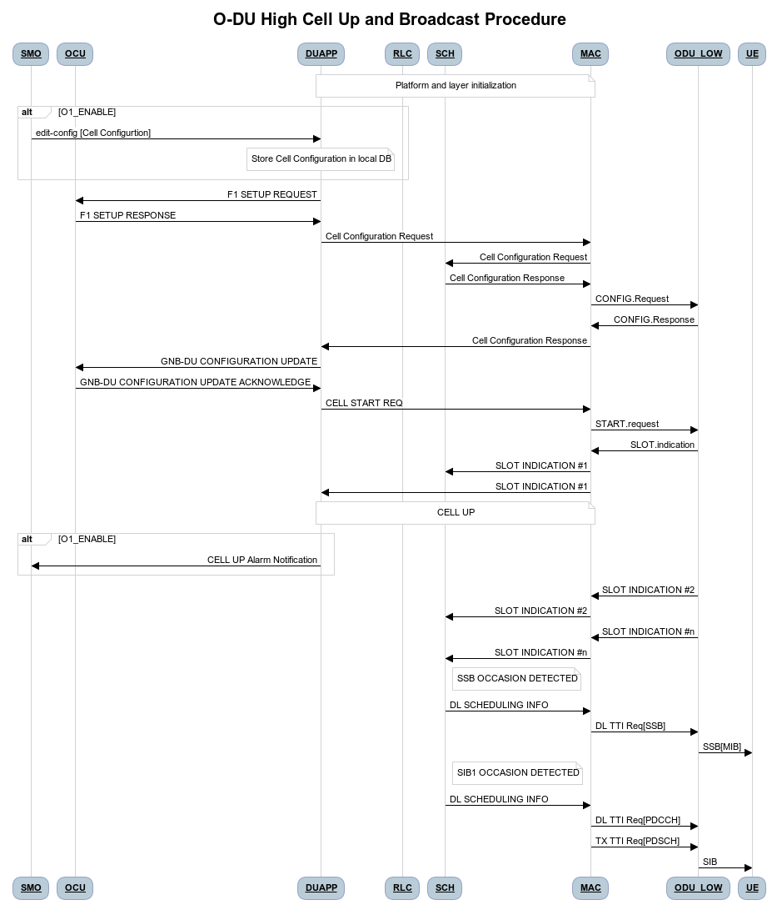

  Figure 4 - O-DU High Cell Up and Broadcast Procedure

As seen in the Figure 4,
- If O1 interface is enabled, SMO sends cell configuration to DU APP. DU APP stores the configurations in its local database.

- If O1 interface is disabled, DU APP module uses static configuration.

- The DU APP module of O-DU High sends F1 Setup Request to O-CU. This message contains a list of cells that the O-DU High has been configured with.

- The O-CU responds with F1 Setup Response. This message contains a list of cells which must be activated.

- The O-DU High scans the list of cells received and sends corresponding cell configurations to 5G NR MAC.

- 5G NR MAC, in-turn configures the 5G NR SCH. It also configures the O-DU Low via the Lower MAC module.

- On receiving the cell config response, DU APP sends a gNB DU Config Update towards the O-CU. The O-CU responds with
  gNB DU Config Update ACK towards the O-DU High.

- The DU APP now exchanges F1 Reset message with the O-CU to initialize the UE contexts.

- DU APP sends Cell Start Req towards 5G NR MAC. This message is translated by the Lower MAC into the FAPI message START.request towards the O-DU
  Low.

- On receiving START.request, O-DU Low begins to send slot indications towards 5G NR MAC via the lower MAC.
  The frequency of these slot indications is determined by the numerology(Mu) supported.
  5G NR MAC forwards these slot indications to the 5G NR SCH and DU APP modules.

- When the first slot indication reaches the DU APP, cell is marked as up. If O1 is enabled, DU APP triggers an alarm to SMO to indicate the CELL is UP.

- The 5G NR SCH, keeps tracking the SSB and SIB1 ocassions on receiving regular slot indications. 
  On detecting the relevant ocassion, 5G NR SCH schedules SSB/SIB1 and forwards the DL Scheduling Information to 5G NR MAC.

- The 5G NR MAC mutiplexes the PDU and sends SSB/SIB1 packets towards the O-DU Low through the Lower MAC.

UE Related Procedure
---------------------

The O-DU High supports 

- All physical channels - PBCH, PRACH, PDCCH, PDSCH, PUSCH, PUCCH

- All control logical channels - UL CCCH, DL CCCH, UL DCCH, DL DCCH

- All control transport channels - BCH, UL-SCH, DL-SCH, RACH

The above channels are used to achieve the below messages:

- Cell broadcast of System Information which includes SSB and SIB1.

- RACH Procedure

  - RACH Indication

  - Random Access Response

  - RRC Setup Request

  - RRC Setup

- UE attach signalling flow

  - RRC Setup Complete

  - Registraton Request

  - NAS Authentication Request

  - NAS Authentication Response

  - NAS Security Mode Command

  - NAS Security Mode Complete

  - RRC Security Mode Command

  - RRC Security Mode Complete

  - Registraton Accept

  - Registraton Complete

  - RRC Reconfiguration

  - RRC Reconfiguration Complete

Figure 5 below depicts the above call flow, inclusive of all interfaces:

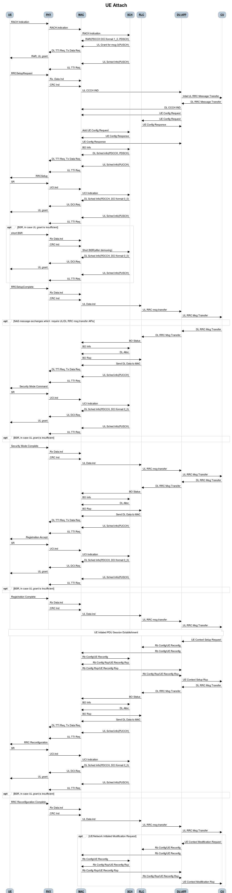

  Figure 5 - UE Attach Flow

- UE Release Signalling flow

  - RRC Release

Closed Loop Automation Procedure
--------------------------------

This section describes the closed loop automation procedure within O-DU High.

.. figure:: CLA_call_flow.png
  :width: 720
  :alt: Closed Loop Automation Procedure

  Figure 6 - O-DU High Closed Loop Automation Procedure

1. SMO commands ODU-High to bring the cell down via O1 interface.

2. DU-APP module of ODU-High sends GNB-DU configuration update message to O-CU. It contains the details of cell to be deleted. O-CU acknowledges this message by sending GNB-DU configuration update acknowledgment.

3. For each UE, DU APP sends UE Context Release Request to O-CU with information about the to be released. O-CU responds with UE Context Release request. It contains the RRC release message. O-DU high sends this RRC Release message to UE.
   
4. DU APP then sends UE delete request to MAC and RLC. Once a confirmation is received from both MAC and RLC, DU APP deletes UE from its own database as well.

5. Once all UEs are released, O-DU High sends STOP.Request to L1. L1 responds with stop indication.

6. Once cell has stopped, DU APP sends cell delete request to MAC. On receiving confimation from MAC, DU APP deletes cell information from its own database as well and sends UE Context Release Complete.

7. On receiving cell bring up command from SMO, the complete Cell bring up and UE attach procedure will be repeated (as explained in above sections)

O1 Netconf get-alarm list procedure
-----------------------------------

This section describes the *Health Status Retrieval* scenario of O-DU High health-check. It enables a northbound client(SMO) to retrieve the health of the O-DU High based on the last self-check performed. The alarm-list is provided as the response to the request via O1 Netconf interface.

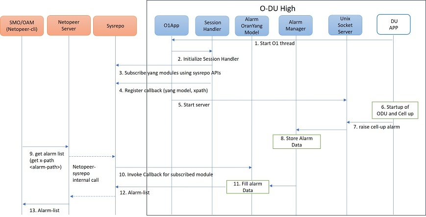

  Figure 7 - O1 get alarm-list flow

As seen in the Figure 7,

- On the cell state change from de-active to activate, DU APP module raises a cell up alarm message and sends it over the Unix socket using the Alarm Interface API.

- On other side a Unix socket server, running as a thread, in O1 module receives the cell up alarm message and it passes on the alarm information to the Alarm Manager.

- Alarm Manager stores the alarm data in a list.

- Whenever SMO/OAM requires the current alarm list, it sends a Netconf get request. The request is received by the Netopeer Server and a callback method, registered with the Session Handler, is invoked.

- The callback function fetches the alarm list from Alarm Manager and sends it back to the client (SMO/OAM) via  Netconf interface. 

Network Slicing procedure
--------------------------

This section describes the Network Slicing feature within O-DU High.

.. figure:: Network_Slicing.png 
  :width: 869
  :alt: Network Slicing flow

  Figure 8 -  Network Slicing flow

As seen in the Figure 8,

- Once the Cell is UP, Slice Configuration received from O1 to O-DU is processed. DU APP forwards the Slice Configuration Request towards MAC which is further forwarded to Scheduler.

- Scheduler stores the Slice Configuration in DB and sends the Slice Configuration Response for each Slice to MAC and further towards DU APP. Slice Configuration Procedure completes.

- Once a UE attaches and PDU session is established then RLC will periodically calculate the Slice Performance Metrics(UL and DL Throughput) for slices configured during UE Context Setup/Modification procedure.

- RLC sends the Consolidated Slice Metrics to DU APP at every 60 sec duration. This is further forwarded towards SMO/Non-RT RIC.

- SMO/Non-RT RIC analyses these metrics and may optimize the slice configuration(RRM Policies) for dedicated slice. This is received at MAC and Scheduler as Slice Reconfiguration Request from DU APP.

- Scheduler updates the received Slice Configuration in its DB and sends back the Slice Reconfiguration Response to MAC and further MAC forwards it to DU APP. Scheduler applies the optimized RRM policies for the dedicated slice.

Idle Mode Paging procedure
--------------------------

This section describes the Idle Mode Paging procedure within O-DU High.

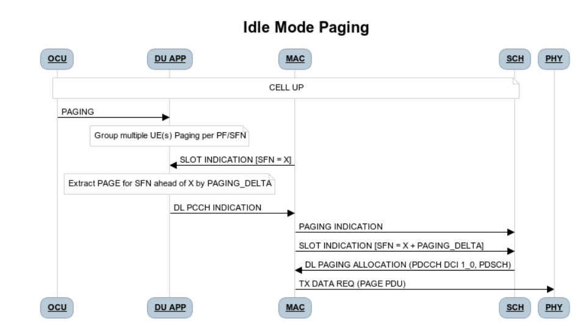

  Figure 9 -  Idle Mode Paging flow

As seen in the Figure 9,

- When a Paging is received from O-CU and the Cell to be Paged is UP then DU APP will calculate Paging Frame(PF) and i_s(Index of Paging Ocassion/Slot) and groups the Paging of UEs falling on same PF/SFN together and stores in its Cell's Databse.

- When a Slot Indication for SFN is received then DU APP extracts the Paging of all UEs whose PF is ahead by PAGING_DELTA and builds Paging RRC PDU. DU APP sends the same via DL PCCH Indication to MAC.

- MAC forwards to SCH as PAGING INDICATION.

- SCH stores the Page Message in its DB and when the SLOT_INDICATION for that SFN arrives, SCH performs scheduling and resource allocation for PDCCH (alongwith DCI 1_0 format) and PDSCH channels and sends to MAC through DL PAGING ALLOCATION message.

- MAC forwards the PAGE to PHY in TX_Data.Request.

Inter-DU Handover within O-CU
------------------------------

This section describes the handling of inter-DU handover of a UE within O-DU High.

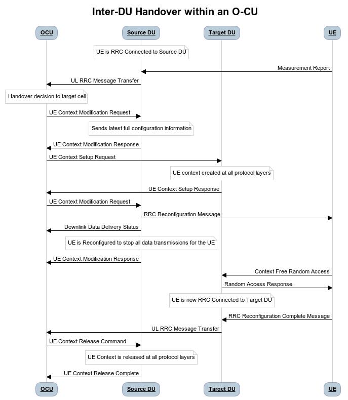
 
   Figure 10 -  Inter_DU Handover call flow

Assumption: UE is RRC connected with DU and PDU data session is active.

- The UE sends Measurement Report message to the source O-DU. This message is sent from O-DU to O-CU in the UL RRC MESSAGE TRANSFER message over F1AP interface.

- Based on UE Measurement Report, O-CU makes a handover decision to another cell belonging to the target O-DU.

- The O-CU sends a UE CONTEXT MODIFICATION REQUEST message to source O-DU to query the latest configuration.

- The DU APP in source O-DU responds with a UE CONTEXT MODIFICATION RESPONSE message that includes latest full configuration information.

- The O-CU sends a UE CONTEXT SETUP REQUEST message to the target O-DU to create an UE context and setup one or more data bearers. The UE CONTEXT SETUP REQUEST message includes Hand-overPreparationInformation. At target O-DU, DU APP sends UE Create Request to MAC and RLC layers to create the UE context with radio resources and receives UE Create Response from the respective protocol layers.

- The target O-DU responds with a UE CONTEXT SETUP RESPONSE message if the target O-DU can admit resources for the handover.

- The O-CU sends a UE CONTEXT MODIFICATION REQUEST message to the source O-DU, which includes RRCReconfiguration message towards the UE. The O-CU also indicates the source O-DU to stop the data transmission for the UE.

- The source O-DU forwards the received RRCReconfiguration message to the UE and then sends the UE Reconfiguration Request to MAC/Scheduler and RLC layer and get the UE Reconfiguration Response from the respective protocol layers.

- The source O-DU responds to the O-CU with UE CONTEXT MODIFICATION RESPONSE message.

- UE triggers Random Access procedure at the target O-DU. This is a contention free random access if UE was informed about its dedicated RACH resources in RRC Reconfiguration message.

- Once Random Access procedure with target O-DU is complete, the UE responds to the target O-DU with a RRCReconfigurationComplete message.

- The target O-DU sends UL RRC MESSAGE TRANSFER message to O-CU to convey the received RRCReconfigurationComplete message.

- The downlink and uplink data packets are sent to/from the UE through the target O-DU.

- The O-CU sends UE CONTEXT RELEASE COMMAND message to the source O-DU.

- The source O-DU sends UE DELETE REQUEST to MAC/RLC layers to release the UE context and receives UE DELETE RESPONSE message.

- The source O-DU responds to O-CU with UE CONTEXT RELEASE COMPLETE message.

Inter-CU Handover (Xn-Based)
------------------------------

This section describes the handling of inter-CU handover of a UE over Xn interface.

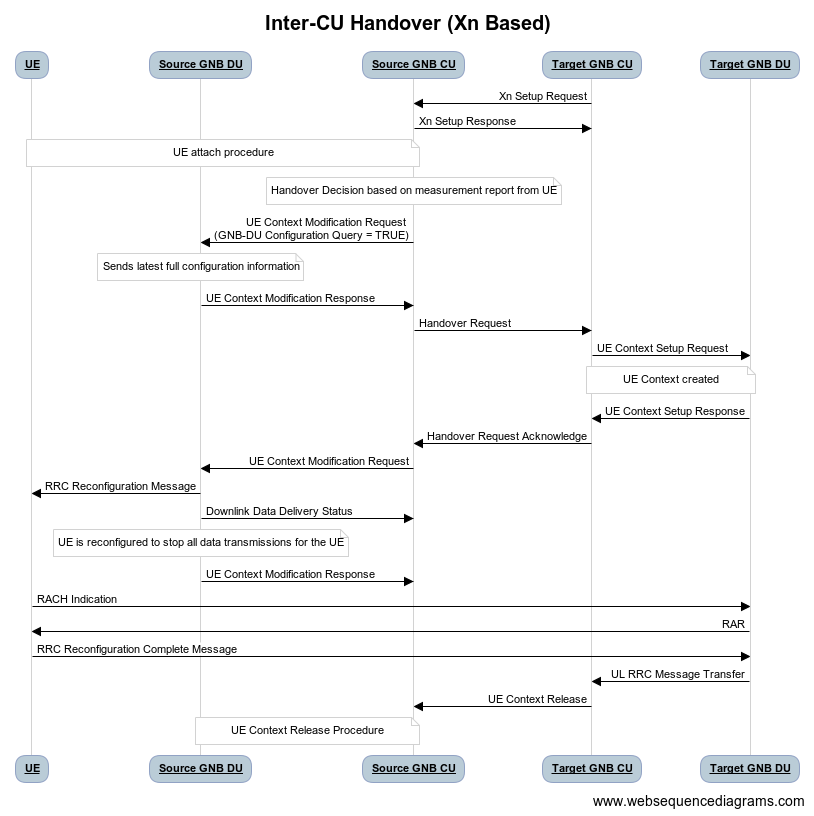
 
   Figure 11 -  Xn-Based Inter-CU Handover call flow

Terminology:

- Source GNB : GNB to which UE is connected and will be handed over from .
- Source GNB DU : O-DU in source GNB
- Source GNB CU : O-CU in source GNB
- Target GNB : GNB to which UE will be handed over to.
- Target GNB DU : O-DU in target GNB
- Target GNB CU : O-CU in target GNB
- Xn Inteface : Interface between Source GNB CU and Target GNB CU
- UE : UE in handover from source GNB to target GNB

Assumptions: 

- Xn setup is established between the two GNB 
- UE is RRC connected with DU 
- PDU data session is active.

Call Flow :

- UE sends Measurement Report message to source GNB. This message is sent from O-DU to O-CU in the UL RRC MESSAGE TRANSFER message over F1AP interface.

- Based on UE Measurement Report, O-CU makes handover decision to a cell belonging to another GNB. Hereafter, this GNB will be referred to as target GNB.

- Before initiating the handover procedure, source GNB CU sends a UE CONTEXT MODIFICATION REQUEST message to source GNB DU to query the latest configurations.

- The source GNB DU responds with UE CONTEXT MODIFICATION RESPONSE message that includes latest full configuration information.

- To start the handover, source GNB CU sends HANDOVER REQUEST to target GNB CU with UE configuration received from source GNB DU.

- Target GNB CU sends a UE CONTEXT SETUP REQUEST message to target GNB DU to create a UE context and setup one or more data bearers. The UE CONTEXT SETUP REQUEST message includes Hand-overPreparationInformation. At DU, DU APP sends UE Create Request to MAC and RLC layers to create the UE context with radio resources and receives UE Create Response from the respective protocol layers.

- The target GNB DU responds with UE CONTEXT SETUP RESPONSE message if it can admit resources for the handover.

- Consequetively, target GNB CU sends HANDOVER REQUEST ACKNOWLEDGE message to source GNB CU to proceed with handover.

- Now source GNB CU sends UE CONTEXT MODIFICATION REQUEST message to source GNB DU, which includes RRCReconfiguration message towards the UE. The CU also indicates the DU to stop the data transmission for the UE.

- Source GNB DU forwards received RRCReconfiguration message to the UE and then sends DOWNLINK DATA DELIVERY STATUS message to CU to inform about successful delivery of message to UE.

- Source GNB DU also sends UE Reconfiguration Request to MAC/Scheduler and RLC layers to stop data scheduling as requested by CU. Once all layers have responded with UE reconfiguration response, source GNB DU send UE CONTEXT MODIFICATION RESPONSE message to source GNB CU.

- Using the information received in RRC Reconfiguration message, UE triggers Random Access procedure towards target GNB DU. This is a contention free random access if UE receives dedicated RACH resources information in RRC Reconfiguration message.

- Once Random Access procedure with target GNB is complete, UE responds to target GNB DU with a RRCReconfigurationComplete message.

- The target GNB DU sends UL RRC MESSAGE TRANSFER message to CU to convey the received RRCReconfigurationComplete message. This completes the UE attach to target GNB.

- The downlink and uplink data packets are now sent to/from the UE through target GNB.

- Once UE is successfully handed over to target GNB, its CU sends UE CONTEXT RELEASE message to source GNB CU.

- Hence, source GNB CU sends UE CONTEXT RELEASE COMMAND message to the source GNB DU. 

- DU releases UE context at all layers and responds to source GNB CU with UE CONTEXT RELEASE COMPLETE message.

Discontinuous reception (DRX)
-----------------------------

This section describes the Discontinuous reception (DRX) feature within O-DU High.

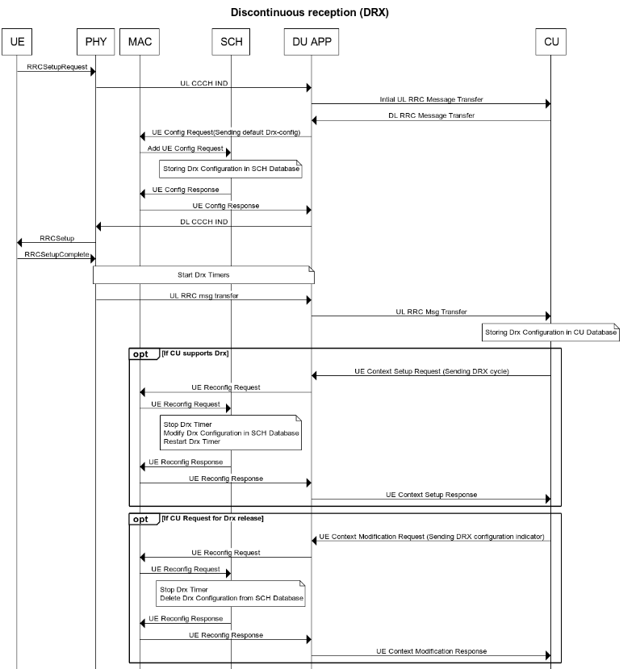

  Figure 12 -  Discontinuous reception flow

- The connected mode DRX is used to improve UE's battery power consumption. This allows UE to be active for a certain amount of time to monitor PDCCH. UE shall become active or inactive based on the DRX timers. 

- When UE is created at O-DU during RRC connection setup procedure, DU APP forwards the default DRX configuration to MAC, who then passes it to SCH as part of UE configuration request. SCH stores these configuration and will use it to calculate the start time and expiry time of various DRX timers. But these timers will only start after UE is RRC connected.

- O-DU may receive modified DRX-configuration in UE CONTEXT SETUP REQUEST from O-CU. DU APP forwards it to MAC who forwards it to SCH as part of UE reconfiguration request. In this case, SCH will stop all DRX timers, re-calculate the start time and expiry time of various timers based on  updated configuration and restart the drx-onDurationTimer. 

- Along with long cycle, DRX in O-DU high also supports short cycle which is enabled if short cycle configuration is recived in UE CONTEXT SETUP REQUEST. 

- DRX timers supported in ODU-High are drx-onDurationTimer, drx-InactivityTimer, drx-ShortCycleTimer, drx-HARQ-RTT-TimerDL, drx-RetransmissionTimerDL, drx-HARQ-RTT-TimerUL and drx-RetransmissionTimerUL. 

- UE is active when any of the following timers is running: drx-onDurationTimer, drx-InactivityTimer, drx-RetransmissionTimerDL or drx-RetransmissionTimerUL, else the UE is considered as inactive.

- Initially, drx-onDurationTimer is started based on long cycle length. While drx-onDurationTimer or drx-InactivityTimer are running, UE becomes active to monitor PDCCH and send data in UL/DL. When drx-InactivityTimer expires, drx-ShortCycleTimer starts. While drx-ShortCycleTimer is running, drx-onDurationTimer is started based on short cycle length. Once drx-ShortCycleTimer expires, long cycle length is used again. Refer to figure 12 below for detailed working of these timers.

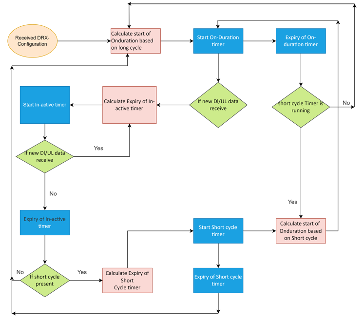

  Figure 13 -  onDurationTimer,InactivityTimer,ShortCycleTimer flow

- If HARQ is received/sent, drx-HARQ-RTT-TimerDL or drx-HARQ-RTT-TimerUL is started. On its expiry drx-RetransmissionTimerDL or drx-RetransmissionTimerUL will start. While it is running, UE becomes active for retransmission of data in DL/UL. Refer to figure 13 and 14 below for detailed working of these timers.

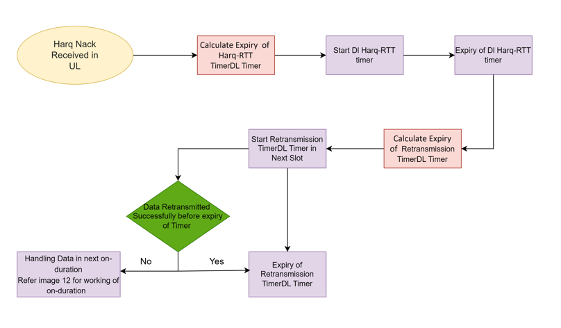

  Figure 14 - DL Harq Retransmission Timers flow

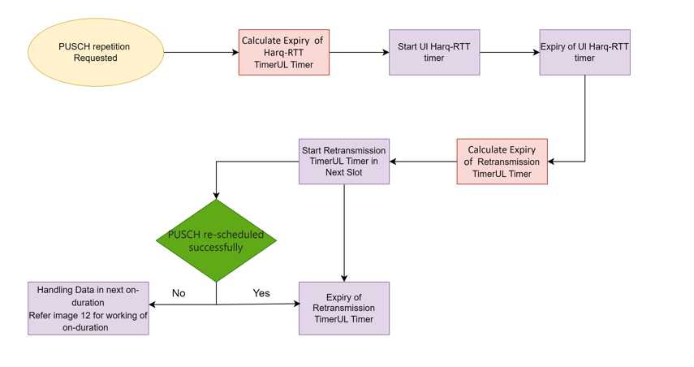

  Figure 15 - UL Harq Retransmission Timers flow

- If O-DU receives DRX configuration release indicator IE as a part of UE CONTEXT MODIFICATION REQUEST from O-CU, DU APP will forward this indicator to MAC which forwards it to SCH as part of UE reconfiguration request. In this case SCH stops all DRX timers, deletes DRX configuration and marks UE as active by default. 

E2AP Functionality
------------------

O-DU High communicates with Near RT RIC on the E2 interface using various Global Procedures and Near-RT RIC Functional Procedures.
The implementation of these procedures are strictly compliant to O-RAN.WG3.E2GAP-R003-v03.00, O-RAN.WG3.E2AP-R003-v03.00.

ODU-High supports E2 Service Model-Key Performance Measurement, compliant to O-RAN.WG3.E2SM-KPM-R003-v03.00.
Following KPIs are implemented in ODU-High as part of E2SM-KPM. These comply with 3GPP 28.552 v15.6.0 section 5.1.1.2 Radio resource utilization.

+--------------------------------+-----------+-----------------------------------------+
|    KPI                         | Section   | Remark                                  |
+================================+===========+=========================================+
|DL Total PRB Usage(RRU.PrbTotDl)| 5.1.1.2.1 | Calulates the total usage of PRBs on DL |
+--------------------------------+-----------+-----------------------------------------+
|UL Total PRB Usage(RRU.PrbTotUl)| 5.1.1.2.2 | Calulates the total usage of PRBs on UL |
+--------------------------------+-----------+-----------------------------------------+

E2 API Flow Triggered in ODU-High's stub-based test framework 
+++++++++++++++++++++++++++++++++++++++++++++++++++++++++++++

This section describes the E2AP messages triggered when executing O-DU High in stub-based test framework.

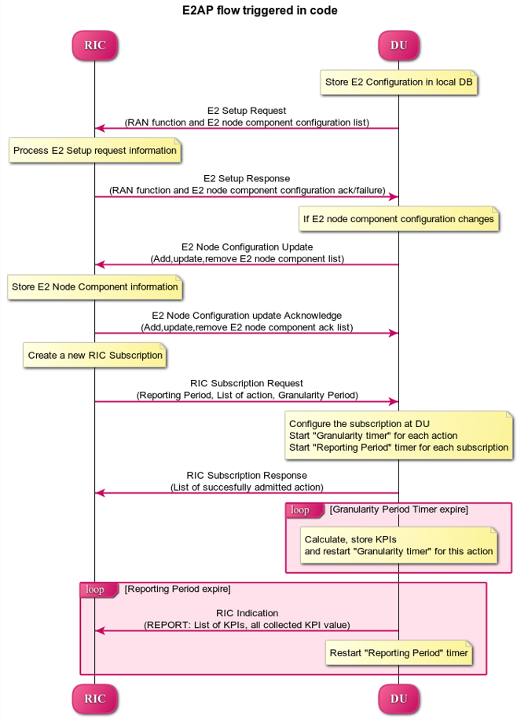

  Figure 16 - E2AP Flow Triggered In Code

E2AP Procedures Supported in ODU-High
++++++++++++++++++++++++++++++++++++++

This section contains flow diagrams for E2AP procedures that may/may not be triggered in ODU-High, however the code supports its working  as per O-RAN WG3 E2 specifications.

E2 Setup Procedure
^^^^^^^^^^^^^^^^^^

This section describes the E2 Setup Procedure within O-DU High and Near-RT RIC. 

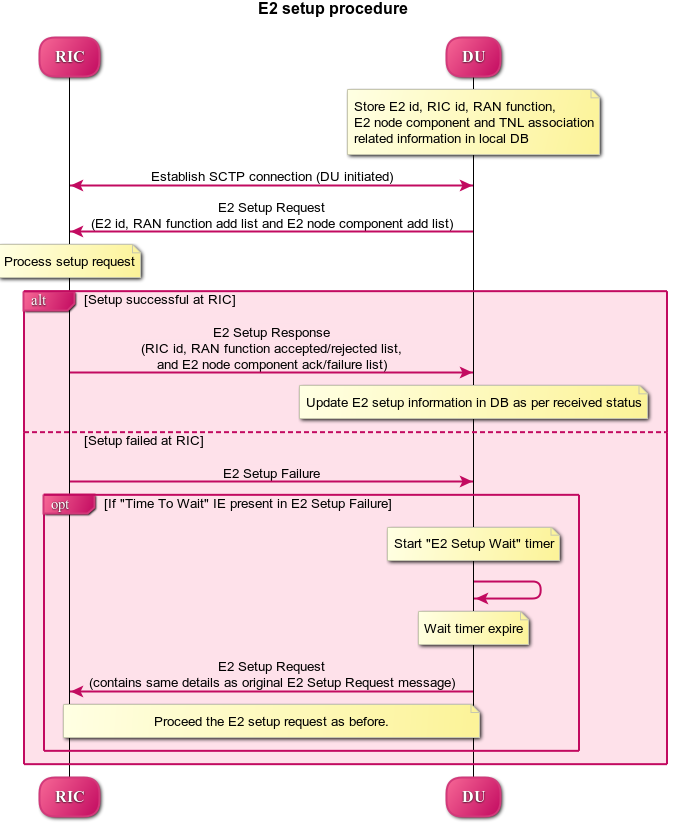

   Figure 17 - E2 Setup Procedure

E2 Node Configuration Update Procedure
^^^^^^^^^^^^^^^^^^^^^^^^^^^^^^^^^^^^^^

This section describes the E2 Node Configuration Procedure within O-DU High and Near-RT RIC. 

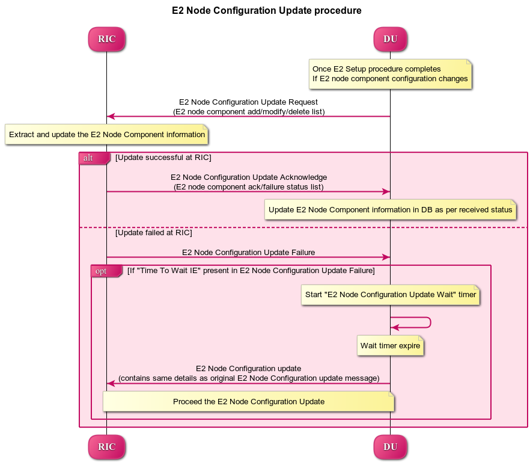

   Figure 18 - E2 Node Configuration Update Procedure

RIC Service Update procedure
^^^^^^^^^^^^^^^^^^^^^^^^^^^^

This section describes the RIC Service Update Procedure within O-DU High and Near-RT RIC.
Note - This API is not currently triggered by ODU-High.

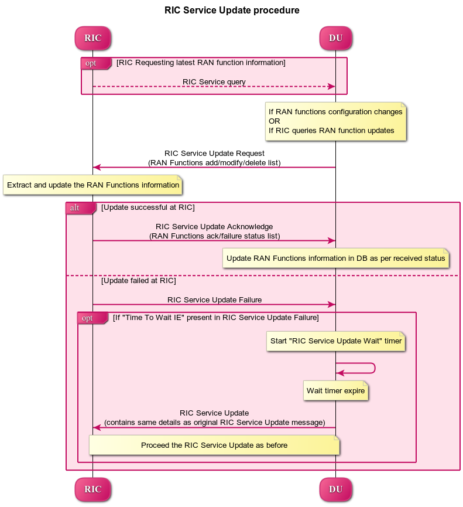

   Figure 19 - RIC Service Update Procedure

E2 Connection Update Procedure
^^^^^^^^^^^^^^^^^^^^^^^^^^^^^^

This section describes the E2 Connection Update Procedure within O-DU High and Near-RT RIC.
Note - This API is not currently triggered by stub-based framework.

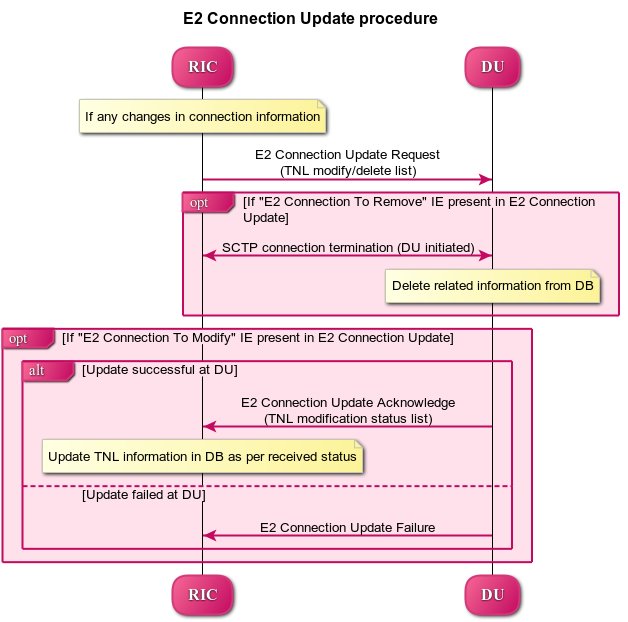

   Figure 20 - E2 Connection Update Procedure

E2 Removal Procedure
^^^^^^^^^^^^^^^^^^^^

This section describes the E2 removal Procedure from both DU-initiated and RIC-initiated within O-DU High and Near-RT RIC.
Note - This API is not currently triggered by ODU-High or Stub-based test framework as of now.

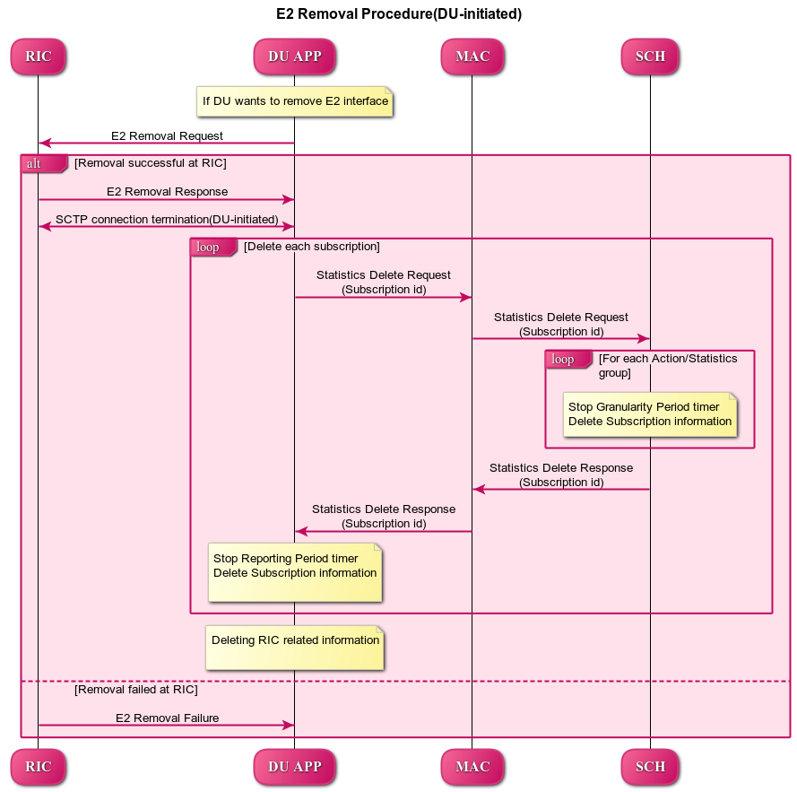

   Figure 21 - E2 Removal Procedure(DU-initiated)

.. figure:: E2_Removal_Procedure(RIC-initiated).PNG 
   :width: 600
   :alt: E2 Removal Procedure(RIC-initiated)

   Figure 22 - E2 Removal Procedure(RIC-initiated)

Reset Procedure
^^^^^^^^^^^^^^^

This section describes the Reset Procedure from both DU-initiated and RIC-initiated within O-DU High and Near-RT RIC.
Note - This API is not currently triggered by ODU-High or Stub-based test framework as of now.

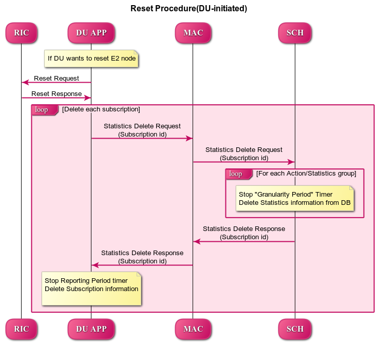

   Figure 23 - Reset Procedure(DU-initiated)

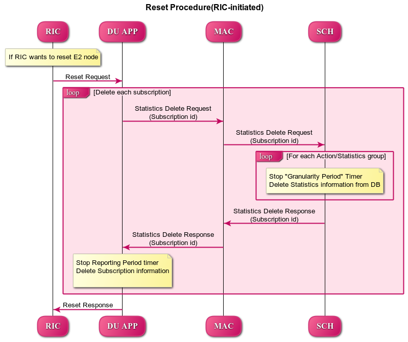

   Figure 24 - Reset Procedure(RIC-initiated)

Error Indication Procedure
^^^^^^^^^^^^^^^^^^^^^^^^^^

This procedure can be triggered from either O-DU or Near-RT RIC. It informs that an error has been found in DU or Near-RT RIC.
Note - This API is not currently triggered by ODU-High or Stub-based test framework as of now.

RIC Subscription Procedure / RIC Indication
^^^^^^^^^^^^^^^^^^^^^^^^^^^^^^^^^^^^^^^^^^^

This section describes the RIC Subscription Procedure within O-DU High and Near-RT RIC. In addition to this procedure, the RIC indication procedure has been described.

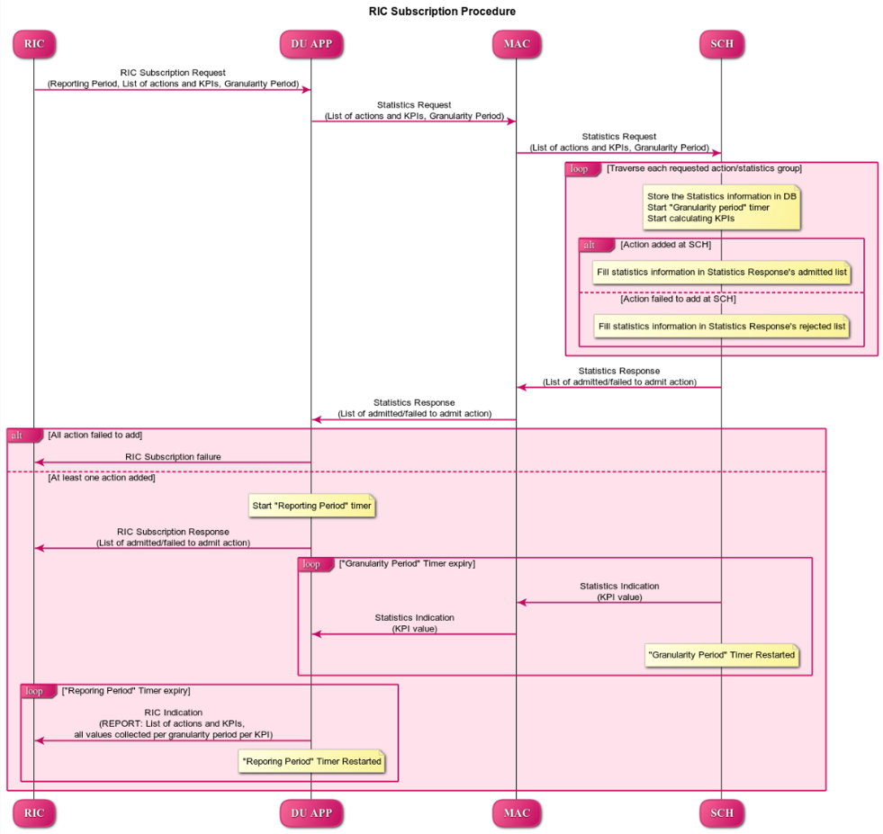

   Figure 25 - RIC Subscription Procedure

RIC Subscription Modification Required
^^^^^^^^^^^^^^^^^^^^^^^^^^^^^^^^^^^^^^

Only framework is added as part of this procedure. The complete handling and flow will be added once use-case is determined.

RIC Subscription Modification Procedure
^^^^^^^^^^^^^^^^^^^^^^^^^^^^^^^^^^^^^^^

This section describes the RIC Subscription Modification Procedure within O-DU High and Near-RT RIC.
Note - This API is not currently triggered by stub-based framework.

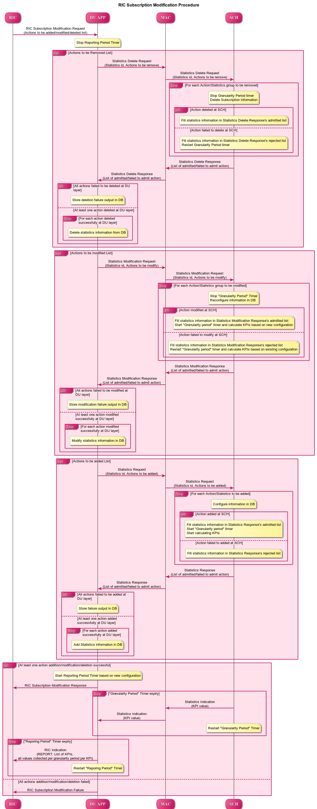

   Figure 26 - RIC Subscription Modification Procedure

RIC Subscription Delete Procedure
^^^^^^^^^^^^^^^^^^^^^^^^^^^^^^^^^

This section describes the RIC Subscription Delete Procedure within O-DU High and Near-RT RIC.
Note - This API is not currently triggered by stub-based framework.

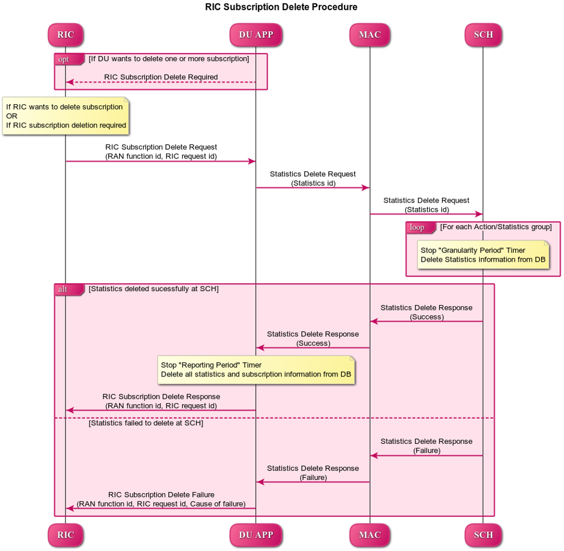

   Figure 27 - RIC Subscription Delete Procedure

OSC Testcases Supported
-----------------------

The O-DU High partially supports below use-cases:

- Traffic Steering

- Health Check

