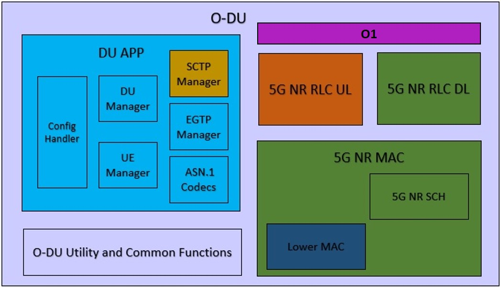
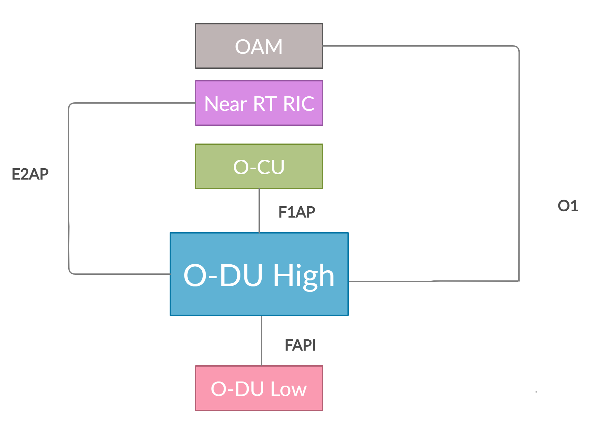

.. This work is licensed under a Creative Commons Attribution 4.0 International License.
.. SPDX-License-Identifier: CC-BY-4.0

O-DU High Architecture
======================

O-DU implements the functional blocks of L2 layer of a 5G NR protocol stack in SA(StandAlone) mode.
These layers primarily include NR MAC NR Scheduler and NR RLC layers.

O-DU modules are developed as shown in the below diagram.

  Figure 1 - O-DU High Architecture Diagram

O-DU High Thread Architecture
-------------------------------

As shown in Figure 1, there are multiple entities within O-DU High. Modules sharing a
given color belong to one thread. O-DU architecture can be defined at a thread
level as follows:

- Thread 1: O-DU thread

- Thread 2: DU APP inclusive of Config Handler, DU Manager, UE Manager, EGTP Handler and ASN.1 Codecs

- Thread 3: 5G NR RLC DL and MAC (inclusive of 5G NR SCH and Lower MAC)

- Thread 4: 5G NR RLC UL

- Thread 5: SCTP Handler

- Thread 6: Lower MAC Handler

O-DU High Modules
--------------------------

DU APP 
^^^^^^^^^^^^^^^^^^
This module configures and manages all the operations of O-DU.
It interfaces with external entities as follows:

- OAM:  DU APP interacts with OAM on the O1 interface for configuration, alarms and performance management.

- O-CU: DU APP interacts with O-CU for RAN functionalities over the F1 interface which is built on SCTP. Control messages are exchanged on the F1-C interface and data messages on the F1-U interface.

- RIC: DU APP interacts with RIC on E2 interface over SCTP.

DU App submodules are as follows:

- Config Handler manages the configurations received on O1 interfaces andstores them within DU APP context.

- DU Manager handles all cell operations at the DU APP.

- UE Manager handles UE contexts at the DU APP.

- SCTP handler is responsible for establishing SCTP connections with O-CU, RIC.

- EGTP handler is responsible for establishing EGTP connection with O-CU for data message exchange.

- ASN.1 Codecs contain ASN.1 encode/decode functions which are used for System information, F1AP and E2AP messages.

5G NR RLC
^^^^^^^^^^^^^^^^^^
This module provides services for transferring the control and data messages
between MAC layer and O-CU (via DU App).

5G NR RLC UL and 5G NR RLC DL are the sub modules of this module that implement
uplink and downlink functionality respectively. 

5G NR MAC
^^^^^^^^^^^^^^^^^^
This module uses the services of the NR physical layer to send and receive data
on the various logical channels.
Functions of the 5G NR MAC module are as follows:

- 5G NR MAC is responsible for multiplexing and de-multiplexing of the data on various logical channels.

- 5G NR SCH schedules resources on UL and DL for cell and UE based procedures.
  5G NR SCH is completely encapsulated within the 5G NR MAC i.e., all intercations that the 5G NR SCH of is via the 5G NR MAC.

- Lower MAC interfaces between the MAC and the O-DU Low. It implements all the messages of FAPI
  specification. It has a receiver thread to handle messages from L1.

O-DU Utility and Common Functions
^^^^^^^^^^^^^^^^^^^^^^^^^^^^^^^^^^^^^^^^^^^^
These modules contain platform specific files and support O-DU High functionality and message exchanges.

O-DU-High Interfaces
======================

This section describes the other modules that O-DU High interfaces with, as shown in below diagram.

  Figure 2 - O-DU High Interfaces

As shown in Figure 2, O-DU High interfaces with the following modules:

- O-CU: O-DU High communicates with O-CU on the F1AP interface. The control message exchanges are on F1-C while
  data message exchanges are on F1-U interfcaes. The below F1AP messages on F1-C are implemented, as per
  3GPP 38.473-f60 v15.3:

  - Interface Management

    - F1 Setup

    - gNB-DU Configuration Update

    - F1 Reset

  - UE Context Management 

    - UE Context Setup

  - RRC Message Transfer
		
    - Initial UL RRC Message Transfer

    - DL RRC Message Transfer

    - UL RRC Message Transfer

    - RRC Delivery Report

- Near RT RIC: O-DU High communicates with Near RT RIC on the E2 interface. The below E2AP messages are
  implemented, as per ORAN WG3.E2AP v01.00:

  - Global procedures

    - E2 Setup

  - Near RT RIC Functional Procedures
		
    - RIC Subscription

    - RIC Indication

- O-DU Low: O-DU High communicates with O-DU Low on the FAPI interface. The below FAPI messages are supported, 
  as per FAPI interface files shared by Intel:

  - P5 messages - PHY mode control interface
	
    - PARAM.request/PARAM.response

    - CONFIG.request/CONFIG.response

    - START.request

    - STOP.request

    - STOP.indication

  - P7 messages - Main data path interface

    - DL_TTI.request

    - UL_TTI.request

    - SLOT.indication

    - UL_DCI.request

    - TX_Data.request

    - RX_Data.indication

    - CRC.indication

    - UCI.indication

    - RACH.indication

- OAM: O-DU High communicates with OAM on the O1 interface.

O-DU High functionality
========================

Cell Up and Broadcast Procedure
--------------------------------

This section describes the cell-up procedure within O-DU High.

.. figure:: CellUpAndBroadcast.png
  :width: 720
  :alt: Cell Up and Broadcast Procedure

  Figure 3 - O-DU High Cell Up and Broadcast Procedure

As seen in the Figure 3,
- The DU APP module of O-DU High sends F1 Setup Request to O-CU. This message contains a list of cells that the O-DU High has been configured with.

- The O-CU responds with F1 Setup Response. This message contains a list of cells which must be activated.

- The O-DU High scans the list of cells recevied and sends corresponding cell configurations to 5G NR MAC.

- 5G NR MAC, in-turn configures the 5G NR SCH. It also configures the O-DU Low via the Lower MAC module.

- On receiving the cell config response, DU APP sends a gNB DU Config Update towards the O-CU. The O-CU responds with
  gNB DU Config Update ACK towrads the O-DU High.

- The DU APP now exchages F1 Reset message with the O-CU to initialize the UE contexts.

- DU APP sends Cell Start Req towards 5G NR MAC. This message is translated by the Lower MAC into the FAPI message START.request towards the O-DU
  Low.

- On receving START.request, O-DU Low begins to send slot indications towards 5G NR MAC via the lower MAC.
  The frequency of these slot indications is determined by the numerology(Mu) supported.
  5G NR MAC forwards these slot indications to the 5G NR SCH and DU APP modules.

- When the first slot indication reaches the DU APP, cell is marked as up.

- The 5G NR SCH, keeps tracking the SSB and SIB1 ocassions on receiving regular slot indications. 
  On detecting the relevant ocassion, 5G NR SCH schedules SSB/SIB1 and forwards the DL Scheduling Information to 5G NR MAC.

- The 5G NR MAC mutiplexes the PDU and sends SSB/SIB1 packets towards the O-DU Low through the Lower MAC.

UE Related Procedure
-----------------------

The O-DU High supports 

- All physical channels - PBCH, PRACH, PDCCH, PDSCH, PUSCH, PUCCH

- All control logical channels - UL CCCH, DL CCCH, UL DCCH, DL DCCH

- All control transport channels - BCH, UL-SCH, DL-SCH, RACH

The above channels are used to achieve the below messages:

- Cell broadcast of System Information which includes SSB and SIB1.

- RACH Procedure

  - RACH Indication

  - Random Access Response

  - RRC Setup Request

  - RRC Setup

- UE attach signalling flow

  - RRC Setup Complete

  - Registraton Request

  - Security Mode Command

  - Security Mode Complete

  - Registraton Accept

  - Registraton Complete

  - Several NAS Message Exchanges

  - RRC Reconfiguration

  - RRC Reconfiguration Complete

Figure 4 below depicts the above call flow, inclusive of all interfaces:

.. figure:: UeAttach.png
  :width: 800
  :alt: O-DU High UE Attach Flow

  Figure 4 - UE Attach Flow

OSC Testcases Supported
=========================

The O-DU High partially supports below use-cases:

- Traffic Steering

- Health Check

