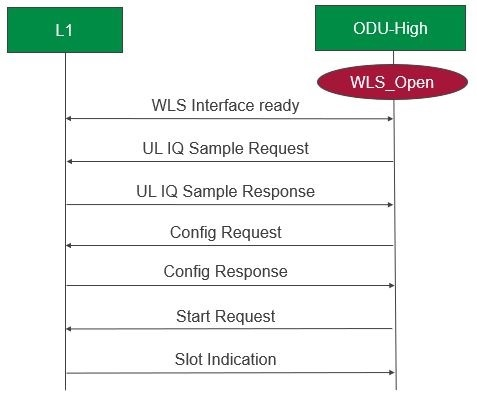

.. This work is licensed under a Creative Commons Attribution 4.0 International License.
.. http://creativecommons.org/licenses/by/4.0

User Guide
==========

This is the user guide for Cherry release of O-DU/l2.

.. contents::
   :depth: 3
   :local:

A. Compilation:
---------------

1. Build O-DU High:

   a. Build folder

      - cd <rsys_directory>/l2/build/odu

   b. Build O-DU High binary
   
      - make odu MACHINE=BIT64 MODE=FDD

   c. Clean O-DU High binary

      - make clean_odu MACHINE=BIT64 MODE=FDD

2. Build CU Stub :

   a. Build folder
   
      - cd <rsys_directory>/l2/build/odu

   b. Build CU Stub binary
   
      - make cu_stub NODE=TEST_STUB MACHINE=BIT64 MODE=FDD

   c. Clean CU Stub binary
   
      - make clean_cu NODE=TEST_STUB MACHINE=BIT64 MODE=FDD

3. Build RIC Stub :

   a. Build folder
   
      - cd <rsys_directory>/l2/build/odu

   b. Build RIC Stub binary
   
      - make ric_stub NODE=TEST_STUB MACHINE=BIT64 MODE=FDD

   c. Clean RIC Stub binary
   
      - make clean_ric NODE=TEST_STUB MACHINE=BIT64 MODE=FDD

4. Clean ODU, CU Stub and RIC Stub together

   a. make clean_all

B. Execution:
-------------

1. Assign virtual IP addresses as follows:

   a. ifconfig <interface name>:ODU "192.168.130.81"
   b. ifconfig <interface name>:CU_STUB "192.168.130.82"
   c. ifconfig <interface name>:RIC_STUB "192.168.130.80"

2. Execute CU Stub:

   a. CU execution folder

      - cd <rsys_directory>/l2/bin/cu_stub

   b. Run CU Stub binary

      - ./cu_stub

3. Execute RIC Stub:

   a. RIC execution folder

      - cd <rsys_directory>/l2/bin/ric_stub

   b. Run RIC Stub binary

      - ./ric_stub

4. Execute DU:

   a. DU execution folder

      - cd <rsys_directory>/l2/bin/odu

   b. Run ODU binary

      - ./odu

PS: CU stub and RIC stub must be run (in no particular sequence) before ODU

C. Testing with Intel O-DU Low:
-------------------------------

I. Compilation
^^^^^^^^^^^^^^

   1. Build ODU :

      a. Create folder <rsys_directory>/l2/src/wls_lib. Copy wls_lib.h from <intel_directory>/phy/wls_lib/ to 
         <rsys_directory>/l2/src/wls_lib.

      b. Create folder <rsys_directory>/l2/src/dpdk_lib. Copy following files from
         <intel_directory>/dpdk-19.11/x86_64-native-linuxapp-gcc/include/ to <rsys_directory>/l2/src/dpdk_lib.
         
         - rte_branch_prediction.h
         - rte_common.h
         - rte_config.h
         - rte_dev.h
         - rte_log.h
         - rte_pci_dev_feature_defs.h
         - rte_bus.h
         - rte_compat.h
         - rte_debug.h
         - rte_eal.h
         - rte_os.h
         - rte_per_lcore.h

      c. Build folder

         - cd <rsys_directory>/l2/build/odu

      d. Build ODU Binary:
           
         - make odu PHY=INTEL_L1 PHY_MODE=TIMER MACHINE=BIT64 MODE=FDD

   2. Build CU Stub and RIC Stub:

      a. Execute steps in sections A.2 and A.3.	

II. Execution
^^^^^^^^^^^^^

   1. Execute O-DU Low:

      a. Setup environment:
      
         - cd <intel_directory>/phy/
         - source ./setupenv.sh

      b. Run O-DU Low binary :
      
         - cd <intel_directory>/FlexRAN/l1/bin/nr5g/gnb/l1
         - To run in timer mode : ./l1.sh -e
         - L1 is up when following prints are seen on console:

		| Non BBU threads in application
		| \==================================================================
		| nr5g_gnb_phy2mac_api_proc_stats_thread: [PID: 8659] binding on [CPU 0] [PRIO: 0] [POLICY: 1]
		| wls_rx_handler (non-rt):                [PID: 8663] binding on [CPU 0]
		| \==================================================================
	  
		PHY>welcome to application console

   2. Execute FAPI Translator:

      a. Setup environment:
   
         - cd <intel_directory>/phy/
         - source ./setupenv.sh

      b. Run FAPI translator binary:

         - cd <intel_directory>/phy/fapi_5g/bin/
         - ./oran_5g_fapi --cfg=oran_5g_fapi.cfg

   3. Execute CU Stub and RIC Stub:

      a. Run steps in sections B.1-B.3.

   4. Execute DU:
   
      a. DU execution folder
     
         - cd <rsys_directory>/l2/bin/odu
      
      b. Export WLS library path

         - export LD_LIBRARY_PATH=<intel_directory>/phy/wls_lib/lib:$LD_LIBRARY_PATH
      
      c. Run ODU binary

         - ./odu

D. Message Flow:
----------------

O-DU High opens WLS interface during bring up. Message exchanges can begin once the interface is ready.
Following diagram shows P5 messages exchange with O-DU Low in timer mode.

  Figure 1 - O-DU High - O-DU Low Message Flow Diagram

Note: UL IQ-Sample request and response are needed by Intel O-DU Low in timer mode(testing mode) only. Code changes for
these are guarded under INTEL_TIMER_MODE flag which can be enabled using compilation option "PHY_MODE=TIMER", as mention
in section C.I.1.d .
